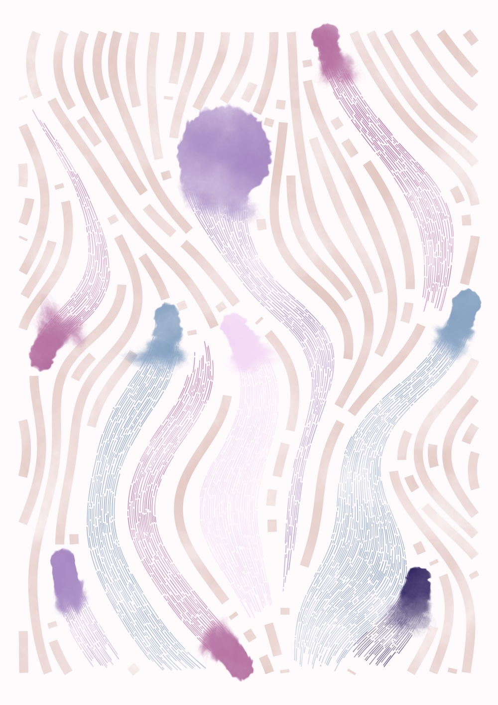

We are happy to announce the release of ggsql 0.3.0 (alpha). This release comes in quick succession to the initial [0.2.7 (alpha) release](https://opensource.posit.co/blog/2026-04-20_ggsql_alpha_release/) and fixes a number of behind-the-scenes issues that we are eager to get out before we begin adding more features and integrations. You can read the full list of changes in the [CHANGELOG](../../CHANGELOG.md).

## Syntax ergonomics
DuckDB showed us the way in terms of making SQL a bit more readable. One of their small but significant insights was that moving the `FROM` in front of `SELECT` made it much easier to visually parse the query since you didn't have to wait until the very end to figure out what the data source is. As a bonus, any language server that wants to suggest column names now has the info from the beginning of the query and can provide aid as you write.

In 0.3.0 we have adopted this for the `VISUALIZE` clause, so that you can now write:

```ggsql
FROM sales
VISUALIZE date AS x, revenue AS y
DRAW line
```

## Goodbye polars
The initial development relied on polars for the internal data frame storage as well as for position computations. In the beginning we were unsure how much we could rely on the database backend for computations but we learned that we could push practically everything (except position adjustment) there. This meant that polars ended up being an extremely heavy dependency that we only used for its DataFrame storage. Removing it took a lot of un-wiring but let us shed more than half of our transitive dependencies (236) and reduce the size of our binary considerably (the wasm binary is now half the size).

This is all great for our main distribution, but even better for the various bindings and integrations we are working on (R, Python, DuckDB) that don't have to bring in heavy dependencies for no gain.

## Goodbye errorbar, hello range
We have decided to rename the `errorbar` layer to `range`. The name was brought over from ggplot2, but we feel that using errorbar is a disservice to what the layer is actually providing, which is a 1D range representation of *any* type of range, in the same way that `ribbon` is a 2D range representation of *any* range. Since we are so early in the life of ggsql, we decided to make a clean cut without a lengthy deprecation process for `errorbar`. Using the old name will result in an error going forward.

## More docs
Leading up to the first release we had spent a lot of time on the documentation on the website. However, all that work hadn't spilled over into the CLI tool. With 0.3.0, the CLI tool now has a `docs` command that you (or your coding agent) can use to get information about the syntax and functionality of ggsql. It is built from the same source as the website so it will mimic that content.

Speaking of coding agents, the CLI now also ships with a skill, accessible through the `skill` command. The same skill can also be installed directly with `npx skills add posit-dev/skills --skill ggsql`

## And all the rest
The release also contains a range of various fixes and infrastructural reorganizations that are less interesting to talk about but can be seen in the [CHANGELOG](../../CHANGELOG.md).

We are excited about the development and what comes next for ggsql. The next release will most likely come with some amazing new user-facing features.
