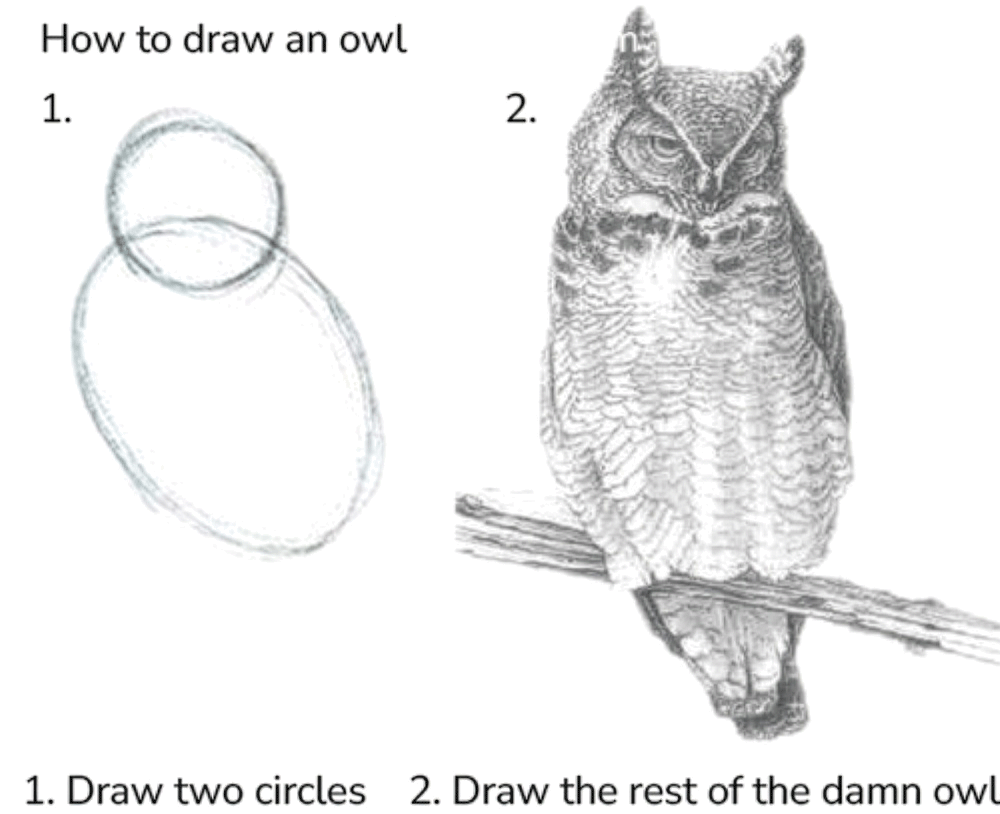

We have covered the three most important concepts of the ggsql syntax: `VISUALISE`, `DRAW`, and `SCALE`. Now it's time to learn how to draw the rest of the owl.

{style="max-width:500px; display:block; margin:auto;"}

Thankfully, we will give you a bit more help than the illustration above in understanding the last bits of ggsql.

## Coordinate systems
In the earlier section we talked about position aesthetics being special because they are being orchestrated by the coordinate system. The coordinate system is the entity that takes care of the spatial arrangement of graphic objects based on their position aesthetic mapping. When thinking about a coordinate system we tend to think about a Cartesian coordinate system which has a horizontal x-axis and a vertical y-axis. There are others though, like polar systems, cartographic maps, and ternary systems. 

At the most basics a coordinate system is a projection function that takes the position aesthetic and projects them into a 2 dimensional plane on the screen or paper. While we commonly have 2 position aesthetics that gets projected to a 2 dimensional plane, this is not a necessity. 3 position aesthetics could be projected to 2 dimensions using a perspective transform or by using a special coordinate system such as a ternary layout.

## Faceting
Faceting is the process of dividing your data by one or more variables and visualizing each group as a small version next to the other group. This technique is also known as creating small multiples. Often, each single plot will share the same position scales so that it is very easy to compare the small representations against each other.

Using faceting is a very powerful way of comparing groups against each other as the sense of distribution within the group is not impaired by the presence of other data in the view.

## Labelling and annotation
While we all want our data to speak for itself, it is impossible to understand a visualization without context. If the visualization is embedded in some text then the context is often given there, but you are never in control of how your visualization is being shared. Because of this you should strive for your plots to be self-explanatory, both in what it represents and what main points it provides. For the former, you will often use title, subtitle, and proper naming of the axes and legends. For the latter you may want to add elements to the plot area that highlights certain aspects of what is shown.

## Syntax
With the remaining part of the grammar under our belt let's examine how it is reflected in the syntax.

### `PROJECT`
We use the [`PROJECT`](../syntax/clause/project.qmd) clause to control the coordinate system of the plot. It both allows you to control the naming of the position aesthetics in the coordinate system, as well as set various parameters that control the behavior of the coordinate system.

The above alludes to the fact that coordinate systems have different position aesthetics. Often you expect `x` and `y` as position aesthetics and while these are indeed the default name for the [`cartesian`](../syntax/coord/cartesian.qmd) coordinate system they would be nonsensical for a [`polar`](../syntax/coord/polar.qmd) system which uses `radius` and `angle` as defaults. You can, however, freely define your own names, e.g. `r` and `a` for a polar system if you value brevity over comprehension.

`PROJECT` also takes a `SETTING` clause which works much like the `SETTING` clause in `DRAW` and `SCALE`, allowing you to modify the behavior of the coordinate system. An example of a full `PROJECT` clause could be:

```ggsql
PROJECT r, a TO polar
  SETTING start => -90, end => 90
```

However, you may not need to specify anything at all. ggsql will automatically detect the use of Cartesian or polar coordinate system from your mapping. If you map to the x or y aesthetics you implicitly use a Cartesian coordinate system, and if you map to radius or angle you implicitly use a polar coordinate system.

### `FACET`
Faceting is applied with the [`FACET`](../syntax/clause/facet.qmd) clause. It allows you to either facet by a single variable (`FACET var`) or by a combination of two variables `FACET var1 BY var2`. In the former case the small multiples are laid out in a row-wise manner, wrapping to the next row if there are more multiples than the number of column. In the latter case the first variable is related to the rows and the second is related to the columns.

There is an alternative to using the `FACET` variable, which is to map the variables directly to the facet aesthetics. There are three of these: `panel` is used when faceting by a single variable and `row` and `column` is used when faceting by two variables. `FACET var` is thus equivalent to `VISUALISE var AS panel`. Whichever you choose to use is thus a matter of personal preference, as well as whether you also need to modify faceting behavior (in which case you'd need a `FACET` clause anyway).

### `LABEL`
ggsql automatically labels the axes and legends in your plot by the column name of the data mapped to it. However, you often want to provide more descriptive names as well as a title to give context to the plot. All of this is accomplished with the [`LABEL`](../syntax/clause/label.qmd) clause by setting the label text for both titles, subtitles, etc. as well as any 
aesthetic you have mapped. A `LABEL` clause may end up looking like this:

```ggsql
LABEL
  title => "Average wingspan of a cartoon owl"
  x => "Radius of first circle (cm)"
  y => "Wingspan (cm)"
```

### `PLACE`
When we want to add graphical objects to the plot that do not directly relate to data in your dataset we can use [`PLACE`](../syntax/clause/place.qmd). The clause works much like the `DRAW` clause except it doesn't take mappings or a data source. Instead you provide the data to place as literal values in the `SETTING` part of the clause. While you can place any type of layer, some are more useful than others and you will probably find yourself placing more text, segments, and rectangles than boxplots and histograms.

A standard `PLACE` query could look like this:

```ggsql
PLACE text
  SETTING x => 30, y => 45, label => "Very long wings, right!"
```

You may wonder why you wouldn't just do this using `DRAW` since that would also be legal query. The reason is the `DRAW` clauses expand their literals to be the same length as their data source. So if the plot is visualizing a table of 100 rows you will end up with 100 labels stacked on top of each other.

## Examples
Let's apply what we have learned to a couple of plots. First, we will create a pie chart by projecting a stacked bar chart to a polar coordinate system:

```{ggsql}
VISUALISE species AS fill FROM ggsql:penguins
DRAW bar
PROJECT TO polar
```

It may be easier to see how the bar chart turns into a pie by looking at it unstacked:

```{ggsql}
VISUALISE species AS radius, species AS fill FROM ggsql:penguins
DRAW bar
```

See how we didn't have to specify the polar coordinate system in the last example because we have a mapping to radius, allowing ggsql to deduce the coordinate system automatically.

If we instead map the species to angle we end up with a rose plot

```{ggsql}
VISUALISE species AS angle, species AS fill FROM ggsql:penguins
DRAW bar
```

Moving back to the regular pie chart, we might be interested in comparing how the species distribution varies by sex. We can do this with faceting:

```{ggsql}
VISUALISE species AS fill FROM ggsql:penguins
DRAW bar
PROJECT TO polar
FACET island
  SETTING free => 'angle'
SCALE panel FROM ('Biscoe', 'Dream')
```

Above, we use the `free` parameter of facet to allow each facet to have their own angle scale. Further, we use `SCALE` on the panel aesthetic to only show panels for the Biscoe and Dream islands.

We can use `LABEL` to add a bit more context to our final plot:

```{ggsql}
VISUALISE species AS fill FROM ggsql:penguins
DRAW bar
PROJECT TO polar
FACET island
  SETTING free => 'angle'
SCALE panel FROM ('Biscoe', 'Dream')
LABEL
  title => 'Distribution of penguin species between islands',
  subtitle => 'Compared across 344 penguins',
  fill => 'Species'
```

## The rest of the rest of the owl
While we have now taken a quick tour through the main features of ggsql along with the theoretical backbone that underpins it there is still a lot to learn. Continue to the last section of the tutorial for a brief wrap up and pointers to where to go next.
