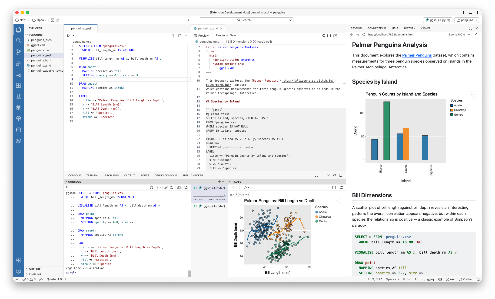
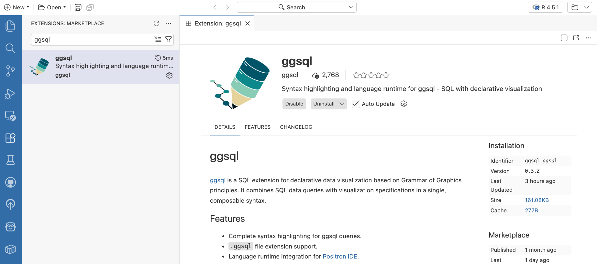
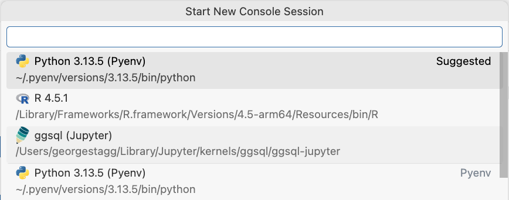
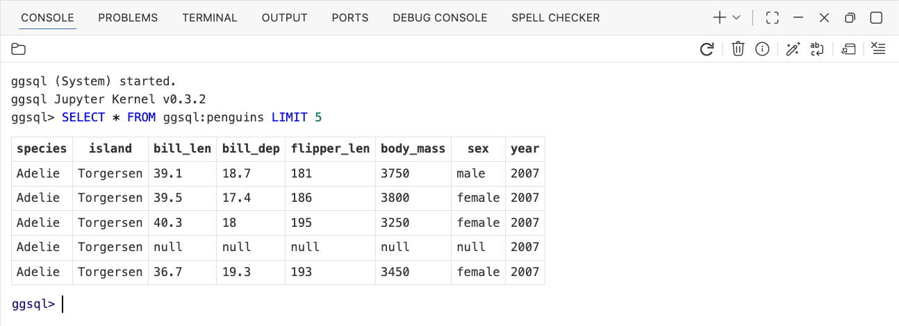
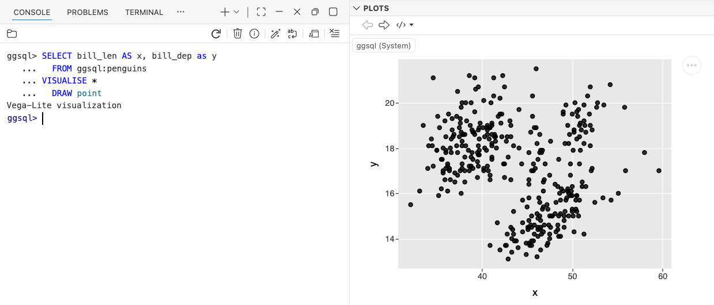
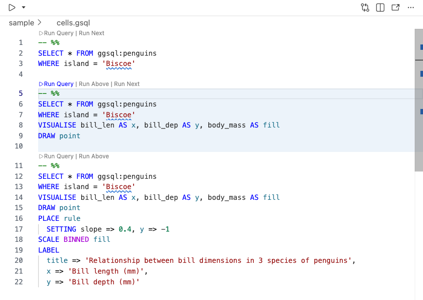
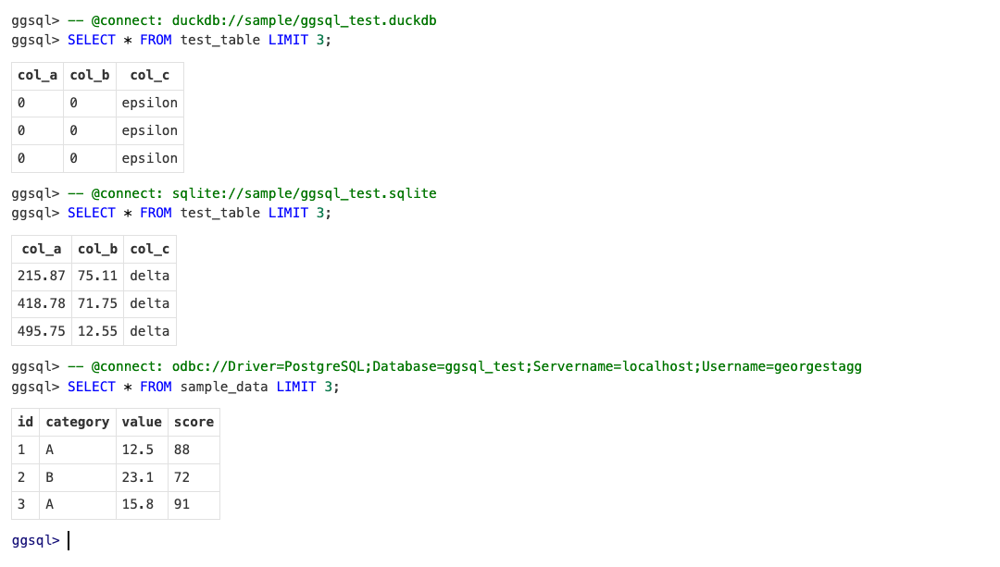
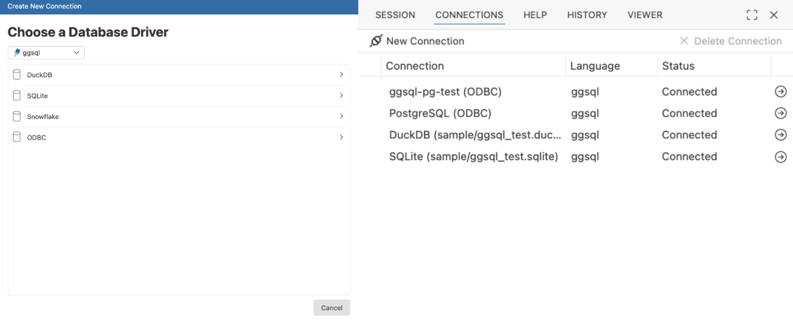

We provide an extension for [VS Code](https://code.visualstudio.com) and [Positron](https://positron.posit.co/) that brings ggsql language support to the IDE. Positron is generally superior for data analysis and the ggsql integration is deeper there, which we will showcase below. Still, using the extension with VS Code should provide you with a good developer experience. Once installed you will get access to ggsql as a language at the same level as R and Python. You can open and edit `.gsql` files with syntax highlighting and autocomplete. 

In Positron you can open up a REPL in the console pane, execute queries, and see the resulting visualization appear in the plot pane. You can add database connections in the connection pane and directly attach these to your ggsql runtime and begin to visualize the tables in there.



## Installation

First, install ggsql on your system using the [installation instructions](../installation.html).

Then, you can grab the ggsql extension directly from the extension section of the Positron IDE, or download it manually from the [OpenVSX extension marketplace](https://open-vsx.org/extension/ggsql/ggsql) (to install, in the *Extensions* view click the `...` menu, select "Install from VSIX...", and choose the downloaded file.)



## Console and plotting

Once the extension has been installed, ggsql will be available to launch as a language runtime in the same way as an R or Python session in Positron's console session selector.



Once started, a ggsql session will be made available in the Console pane, providing a REPL for executing standard SQL or ggsql code. When first launched, ggsql will be started with an empty in-memory duckdb database connection.



Executing ggsql statements containing [`VISUALISE`](../../syntax/clause/visualise.html) will render the resulting visualization in the Plots pane.




## Editor and cells

The `ggsql` language type can be used to enable syntax highlighting and autocomplete. Files with extension `.gsql` will automatically be configured to use the `ggsql` language type.

In Positron, a "Source Current File" button is provided in the top left of the Editor pane, which will execute the entire contents of the currently open file in the Positron console. You can also create "cells" in your editor, which are blocks of code that can be independently executed.

To create a cell, simply add a line with `-- %%` between blocks of code in your ggsql source file. You can then execute the contents a particular cell in the console by clicking the "Run Query" button that appears above the separator.



## Using ggsql with `.sql` files {#sql-files}

ggsql is a superset of SQL, so the ggsql console can execute a plain SQL query. The extension offers the "Source Current File" button and code cells in `.sql` files as well as `.gsql` files, which means you can run SQL you already have against a ggsql kernel without renaming anything.

By default `.sql` files keep their usual SQL syntax highlighting, so any other database tooling you have installed continues to work as before. If you would rather give `.sql` files the full ggsql treatment, including highlighting for `VISUALISE` and the other ggsql clauses, map them to the `ggsql` language type:

```json
"files.associations": {
    "*.sql": "ggsql"
}
```

The extension points you at this setting when you open a `.sql` file, but it never changes the setting for you. Mapping `*.sql` affects every `.sql` file you open, so the choice is left to you. Add it to a single workspace rather than your user settings if you only want it for one project, and use "Don't show again" on the notification if you would rather not be reminded.

If you use `.sql` files with other database tooling and would prefer the extension leave them alone entirely, turn the run buttons and cells off:

```json
"ggsql.enableSqlFiles": false
```

## Importing data files

Dragging a `.csv`, `.tsv`, `.parquet`, or `.json` file into Positron offers to generate the code that loads it, and ggsql is one of the importers on offer. The generated code is a `CREATE TABLE … AS SELECT …` statement that reads the file into a table, and if you open the import dialog from a Data Explorer view it can also reproduce the filters and sorts you have applied there as `WHERE` and `ORDER BY` clauses.

The generated code targets a duckdb session — the default, empty in-memory connection ggsql starts with. Reading files with `FROM 'file.csv'` is duckdb functionality, so the import will not run in a session attached to another database backend with `-- @connect:`. For the same reason, filter expressions use duckdb syntax such as `ILIKE` and `regexp_matches()`; anything the importer cannot translate is listed as a warning next to the generated code rather than dropped silently.

## Database connections

By default, ggsql starts in the Positron console with an empty in-memory duckdb database connection. A "magic" comment can be used to initiate a different database connection after the session has launched, which can be either a comment in your source file or invoked directly in the console.

The connection syntax is `-- @connect: [connection_uri]`, where `[connection_uri]` is a ggsql database connection string in the same format as accepted by the [ggsql CLI](cli.html).



The ggsql extension also integrates with Positron's connections pane, allowing you to easily connect to databases that you have configured in Positron. Connections made in the console, as above, will be saved to the connections pane automatically, or a connections wizard can be launched to help connect to supported databases by selecting the "New Connection" button in the Positron Connections pane.


