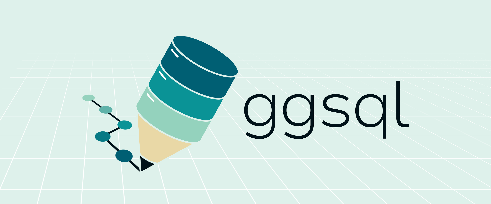

::: {.hero-banner}
{.hero-image}

::: {.hero-content}
# SQL meets Grammar of Graphics

A declarative visualization language that extends SQL with powerful data visualization capabilities.

::: {.hero-buttons}
[Get Started](get_started.qmd){.btn .btn-secondary .btn-lg}
[View Examples](gallery/index.qmd){.btn .btn-outline-light .btn-lg}
:::

:::
:::

::: {.content-block}
## Features

::: {.features}

::: {.feature}
### Familiar Syntax

Write standard SQL queries and seamlessly extend them with visualization clauses. Your existing SQL knowledge transfers directly.

```{.ggsql .code-example}
SELECT date, revenue, region
FROM sales
WHERE year = 2024
VISUALISE date AS x, revenue AS y
DRAW line
```
:::

::: {.feature}
### Grammar of Graphics

Compose visualizations from independent layers, scales, and coordinates. Mix and match components for powerful custom visuals.

```{.ggsql .code-example}
VISUALISE date AS x FROM sales
DRAW bar 
SCALE BINNED x 
    SETTING breaks => 'weeks'
FACET region
```
:::

::: {.feature}
### Built for Humans _and_ AI

The structured syntax makes it easy for AI agents to write, and for you to read, adjust, and verify.

You also avoid needing agents to launch full programming languages like Python or R to create powerful visualizations, so you can rest assured that the agent doesn't accidentally alter your environment in unwanted ways.
:::

::: {.feature}
### There where you need it

ggsql is available where you do your data analysis:

::: {.tool-grid}
::: {.tool-item}
{.tool-logo}
Positron
:::
::: {.tool-item}
{.tool-logo}
Quarto
:::
::: {.tool-item}
{.tool-logo}
Jupyter
:::
::: {.tool-item}
{.tool-logo}
VS Code
:::
:::
:::

:::

:::

::: {.content-block .alt-bg}

::: {.cta-section}

## Ready to get started?

Install ggsql and start creating visualizations in minutes.

::: {.cta-buttons}
[Installation](get_started.qmd){.btn .btn-primary .btn-lg}
[Documentation](syntax/index.qmd){.btn .btn-outline-primary .btn-lg}
[Examples](examples.qmd){.btn .btn-outline-secondary .btn-lg}
:::

Or try our [online playground](wasm/) to experience the syntax _right now_.

:::

:::
