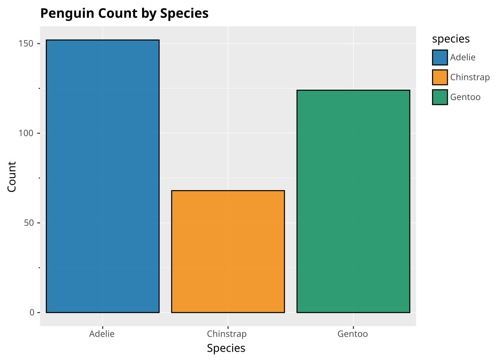
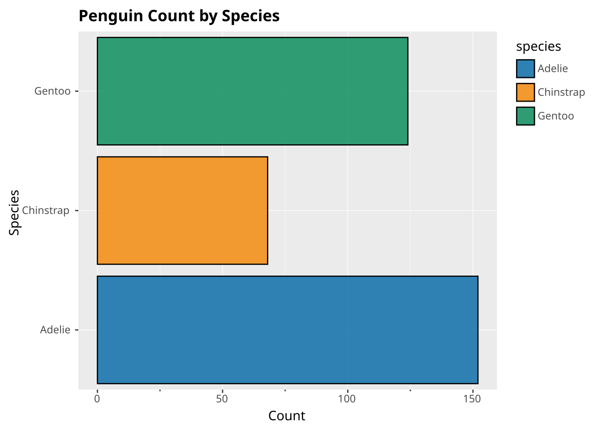
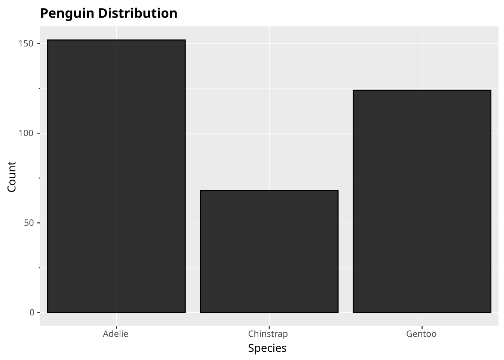

# Bar chart

basic

bar

Categorical comparisons using bars

Bar charts display categorical data with rectangular bars. The height of each bar represents the value for that category.

## Code

``` ggsql
SELECT species, COUNT(*) as count FROM ggsql:penguins
GROUP BY species
VISUALISE species AS x, count AS y, species AS fill
DRAW bar
LABEL
  title => 'Penguin Count by Species',
  x => 'Species',
  y => 'Count'
```

[](bar-chart_files/figure-html/cell-2-output-1.svg)

## Explanation

- The SQL query aggregates penguin counts by species
- `species AS x` places species names on the x-axis
- `count AS y` sets the bar height based on the count
- `species AS fill` colors each bar by species
- `DRAW bar` creates vertical bars

## Variations

### Horizontal bars

Use `PROJECT y, x TO cartesian` to flip the axes for horizontal bars:

``` ggsql
SELECT species, COUNT(*) as count FROM ggsql:penguins
GROUP BY species
VISUALISE species AS x, count AS y, species AS fill
DRAW bar
PROJECT y, x TO cartesian
LABEL
  title => 'Penguin Count by Species',
  x => 'Species',
  y => 'Count'
```

[](bar-chart_files/figure-html/cell-3-output-1.svg)

### Auto-count bar chart

When you don’t specify a y aesthetic, ggsql automatically counts occurrences:

``` ggsql
SELECT species FROM ggsql:penguins
VISUALISE species AS x
DRAW bar
LABEL
  title => 'Penguin Distribution',
  x => 'Species',
  y => 'Count'
```

[](bar-chart_files/figure-html/cell-4-output-1.svg)
