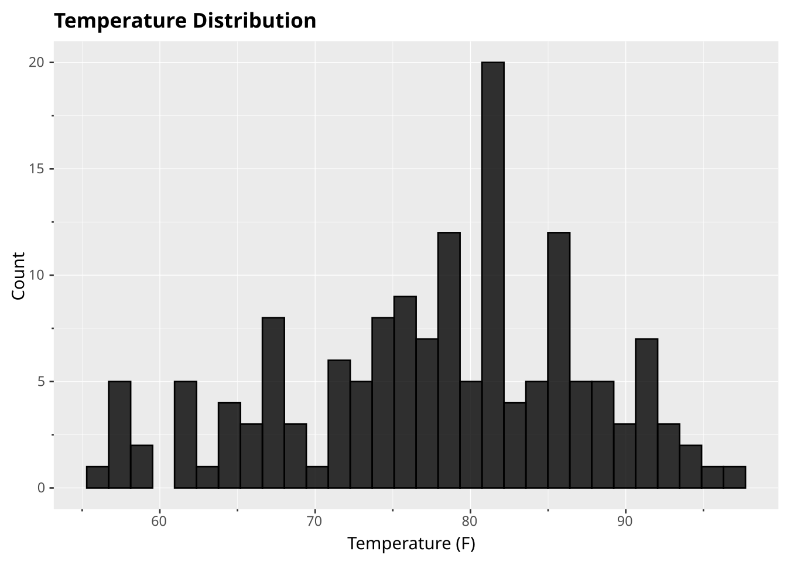
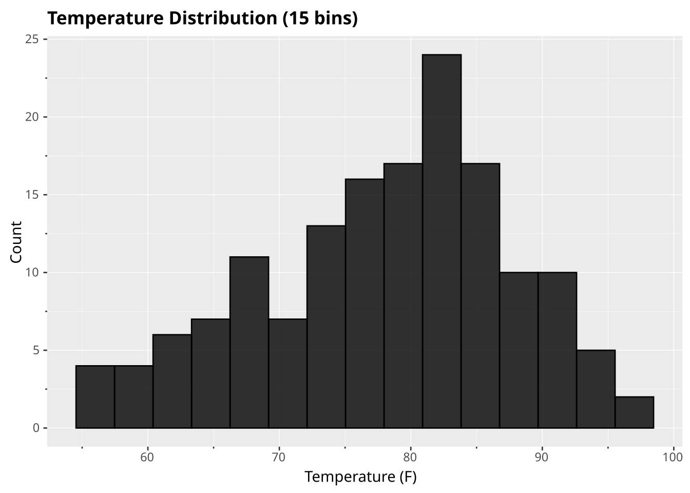
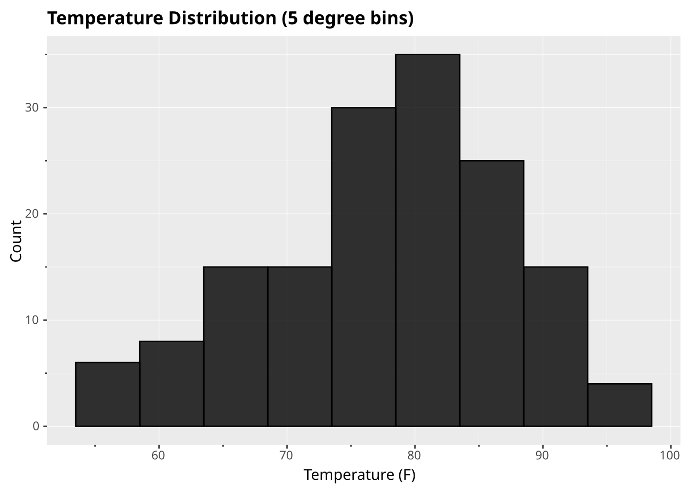
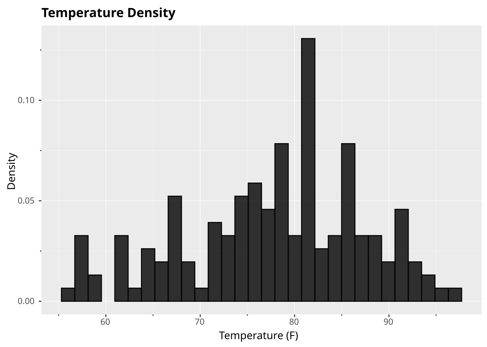

# Histogram

statistical

distribution

Distribution of a single numeric variable

Histograms show the distribution of a numeric variable by grouping values into bins and counting occurrences in each bin.

## Code

``` ggsql
SELECT Temp FROM ggsql:airquality
VISUALISE Temp AS x
DRAW histogram
LABEL
  title => 'Temperature Distribution',
  x => 'Temperature (F)',
  y => 'Count'
```

[](histogram_files/figure-html/cell-2-output-1.svg)

## Explanation

- `VISUALISE Temp AS x` specifies the variable to bin
- `DRAW histogram` automatically computes bins and counts
- No y mapping is needed - ggsql computes the count automatically

## Variations

### Custom bin count

Control the number of bins with `SETTING bins`:

``` ggsql
SELECT Temp FROM ggsql:airquality
VISUALISE Temp AS x
DRAW histogram
  SETTING bins => 15
LABEL
  title => 'Temperature Distribution (15 bins)',
  x => 'Temperature (F)',
  y => 'Count'
```

[](histogram_files/figure-html/cell-3-output-1.svg)

### Custom bin width

Set explicit bin width instead of count:

``` ggsql
SELECT Temp FROM ggsql:airquality
VISUALISE Temp AS x
DRAW histogram
  SETTING binwidth => 5
LABEL
  title => 'Temperature Distribution (5 degree bins)',
  x => 'Temperature (F)',
  y => 'Count'
```

[](histogram_files/figure-html/cell-4-output-1.svg)

### Density instead of count

Use `REMAPPING` to show density (proportion) instead of count:

``` ggsql
SELECT Temp FROM ggsql:airquality
VISUALISE Temp AS x
DRAW histogram
  REMAPPING density AS y
LABEL
  title => 'Temperature Density',
  x => 'Temperature (F)',
  y => 'Density'
```

[](histogram_files/figure-html/cell-5-output-1.svg)
