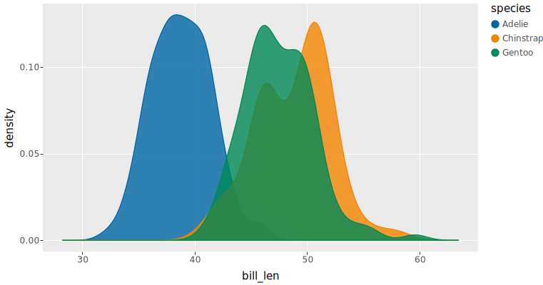
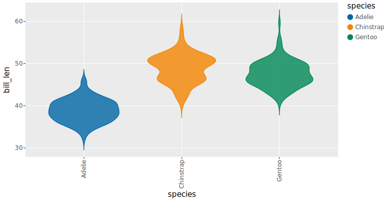
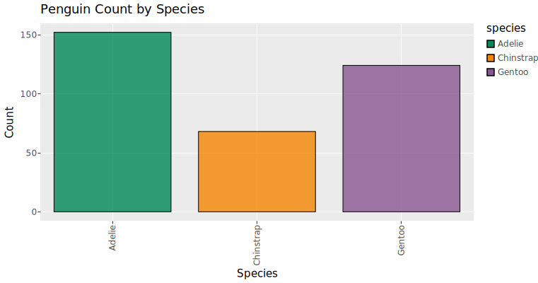
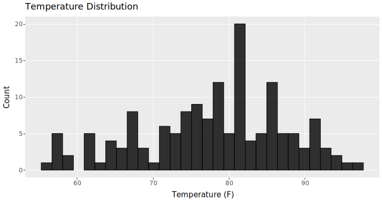
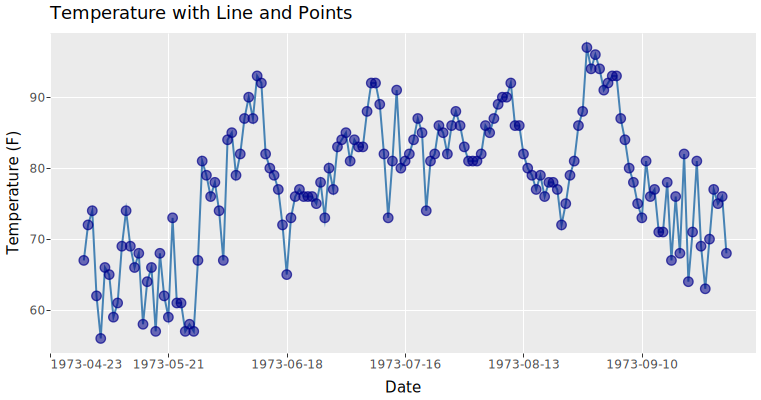
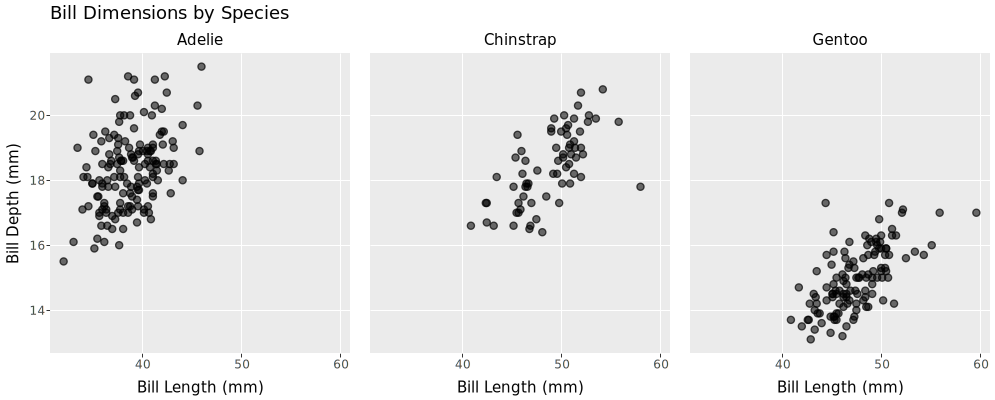

# Example gallery

Browse examples of ggsql visualizations. Click any example to see the full code and explanation.

##### Scatter plot

Basic scatter plot mapping two numeric variables to position

##### Napoleon’s march to Moscow

Re-creating the famous visualisation from Minard.

##### Line chart

Time series visualization with proper date scaling

##### Pie chart

Visualisation of proportions

##### Density plots

Showing smooth distributions of single numeric variables

##### Box plots

Showing groups of distributions of single numeric variables

##### Heatmap

Arranging tiles on a grid

##### Violin plots

Showing groups of distributions of single numeric variables

##### Bar chart

Categorical comparisons using bars

##### Histogram

Distribution of a single numeric variable

##### Multi-layer plot

Combining multiple geometric layers in one visualization

##### Faceted plot

Small multiples showing data split by category
