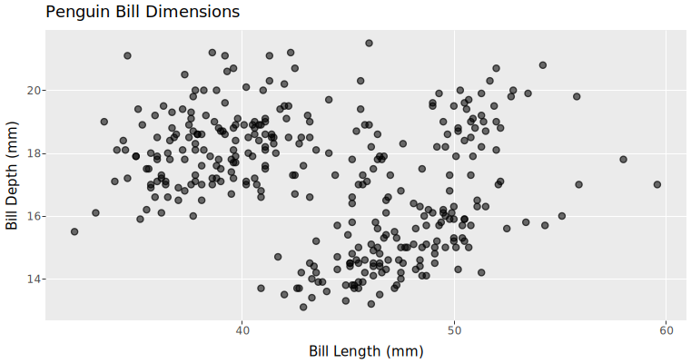
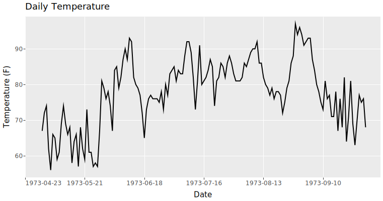
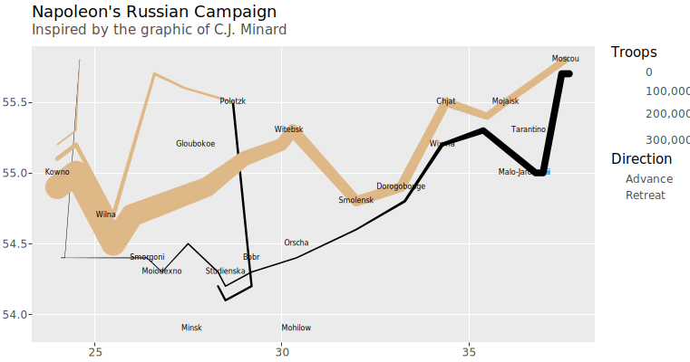
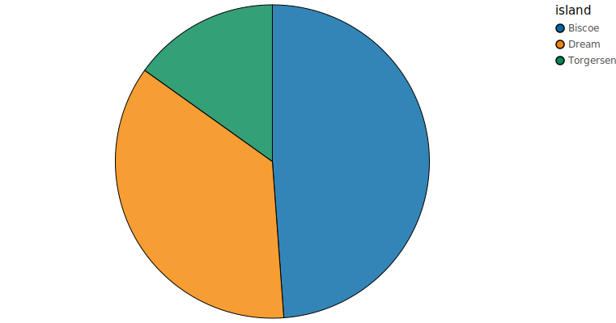
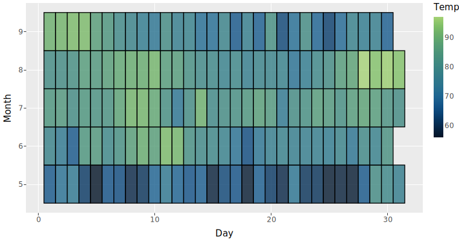
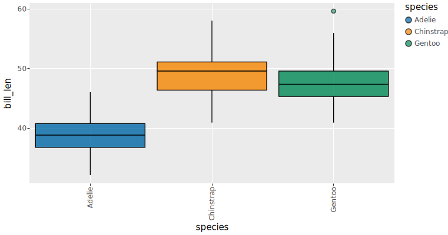

# QUERY VISUALIZE UNDERSTAND

ggsql brings the elegance of the [Grammar of Graphics](get_started/grammar.llms.md) to SQL. Write familiar queries, add visualization clauses, and see your data transform into beautiful, composable charts — no context switching, no separate tools, just SQL with superpowers.

[Get started](get_started/installation.llms.md) [View examples](gallery/index.llms.md)

### Try it out

``` ggsql
-- Regular query
SELECT * FROM ggsql:penguins
WHERE island = 'Biscoe'
-- Followed by visualization declaration
VISUALISE bill_len AS x, bill_dep AS y, body_mass AS fill
DRAW point
PLACE rule 
  SETTING slope => 0.4, y => -1
SCALE BINNED fill
LABEL
  title => 'Relationship between bill dimensions in 3 species of penguins',
  x => 'Bill length (mm)',
  y => 'Bill depth (mm)'
```

## Explore the examples



##### Scatter plot



##### Line chart



##### Napoleon’s march to Moscow



##### Pie chart



##### Heatmap



##### Box plots

[See all examples →](gallery/index.llms.md)

### Install it today

[Other platforms](get_started/installation.llms.md)

or

``` bash
# Jupyter kernel (PyPI)
uv tool install ggsql-jupyter
ggsql-jupyter --install

# CLI (crates.io)
cargo install ggsql
```

## Features

### Familiar syntax

Write standard SQL queries and seamlessly extend them with visualization clauses. Your existing SQL knowledge transfers directly.

``` ggsql
SELECT date, revenue, region
FROM sales
WHERE year = 2024
VISUALISE date AS x, revenue AS y
DRAW line
```

### Grammar of graphics

Compose visualizations from independent layers, scales, and coordinates. Mix and match components for powerful custom visuals. The [grammar of graphics](get_started/grammar.llms.md) provides you with a single mental model for every type of plot.

``` ggsql
VISUALISE date AS x FROM sales
DRAW bar 
SCALE BINNED x 
    SETTING breaks => 'weeks'
FACET region
```

### Built for humans *and* AI

The structured syntax makes it easy for AI agents to write, and for you to read, adjust, and verify.

You also avoid needing agents to launch full programming languages like Python or R to create powerful visualizations, so you can rest assured that the agent doesn’t accidentally alter your environment in unwanted ways.

### Connect directly to your data

ggsql interfaces directly with your database. Want to create a histogram over 1 billion observations? No problem! All calculations are pushed to the database so you only extract what is needed for the visual.

## Available where your data is

[ Positron](get_started/installation.llms.md#vs-code--positron-extension)

[ Quarto](get_started/installation.llms.md#jupyter-kernel)

[ Jupyter](get_started/installation.llms.md#jupyter-kernel)

[ VS Code](get_started/installation.llms.md#vs-code--positron-extension)

## Ready to get started?

Install ggsql and start creating visualizations in minutes.

[Installation](get_started/installation.llms.md) [Documentation](syntax/index.llms.md) [Examples](gallery/index.llms.md)

Or try our [online playground](wasm/) to experience the syntax *right now*.
