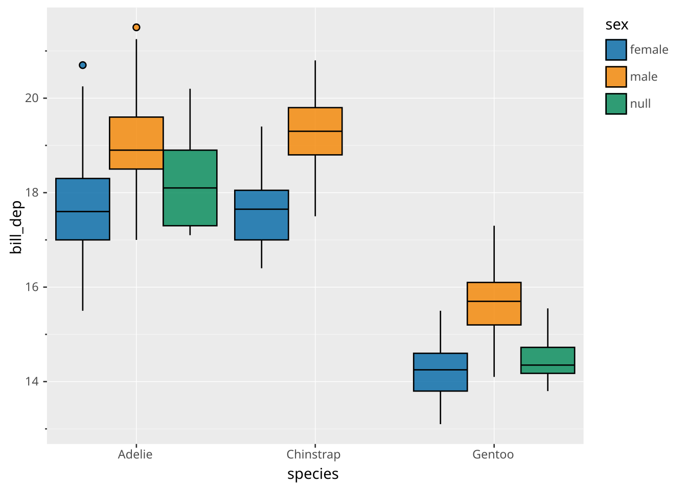
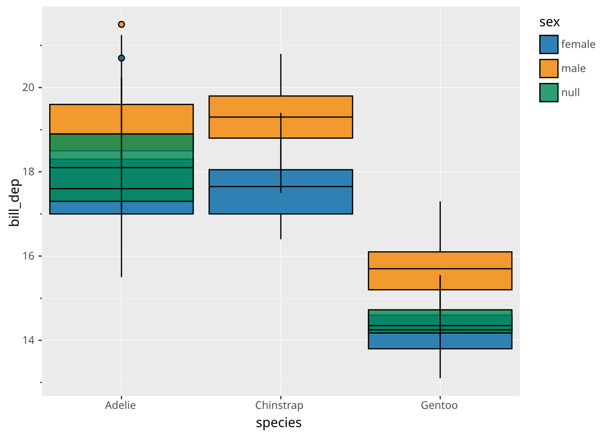
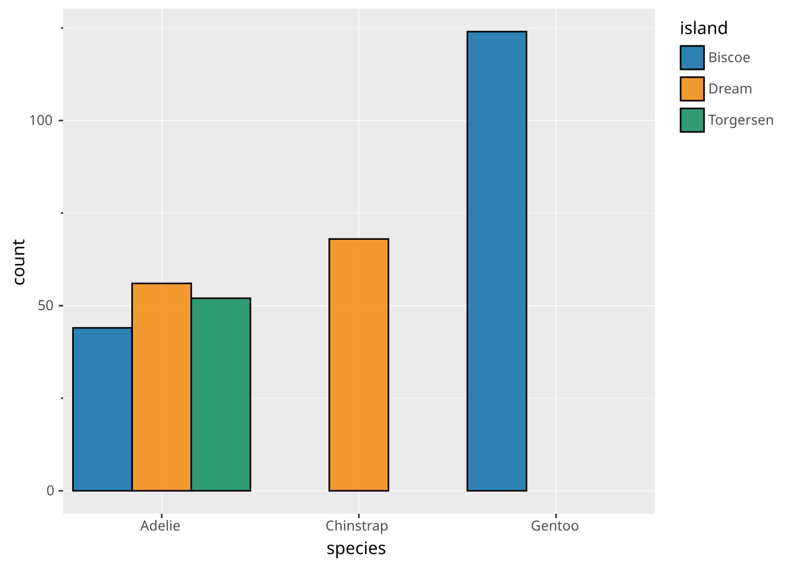
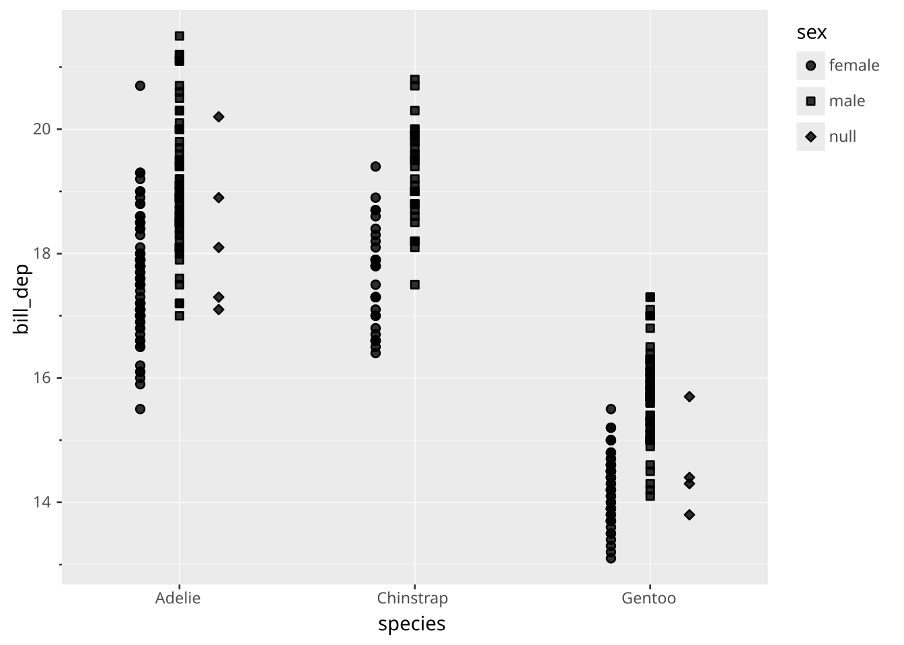

# Dodge

> Positions are set within the [`DRAW` clause](../../../syntax/clause/draw.llms.md), using the `SETTING` subclause. Read the documentation for this clause for a thorough description of how to use it.

The dodge adjustment is intended to move entities that share the same position on a discrete scale side by side so they don’t overlap. It is most often used for boxplots and violin plots, but can also be used in e.g. bar plots as an alternative to [stacking](../../../syntax/layer/position/stack.llms.md).

## Position scale requirements

Dodge doesn’t have specific requirements to the scale type of the plot, but will only affect discrete scales (including binned and ordinal). If only one scale is discrete, the dodging happens in that scale’s direction. If both scales are discrete, the dodging happens as a 2D grid.

Dodging only takes effect if two or more groups actually meet on the same position — that is what there is to separate. Mapping an aesthetic to the same variable as the discrete axis, for instance, gives every group a position of its own, and the layer is drawn at its full width as if no dodging had been asked for. Groups in different [facet](../../../syntax/clause/facet.llms.md) panels don’t meet either. Where any position does hold several groups, the whole layer dodges, so an element occupies the same slot in every position and stays comparable across them.

## Settings

Apart from the settings of the layer type, setting `position => 'dodge'` will allow these additional settings:

- `width`: The total width the dodging will occupy as a proportion of the space available on the scale (0 to 1). Defaults to 0.9 but any defaults from the layer will take precedence.

## Examples

Dodging is default in boxplots (and violin plots)

``` ggsql
VISUALISE species AS x, bill_dep AS y, sex AS fill FROM ggsql:penguins
DRAW boxplot
```

[](dodge_files/figure-html/cell-2-output-1.svg)

Turning it off allows you to see the effect of it

``` ggsql
VISUALISE species AS x, bill_dep AS y, sex AS fill FROM ggsql:penguins
DRAW boxplot 
  SETTING position => 'identity'
```

[](dodge_files/figure-html/cell-3-output-1.svg)

Dodge can be used for bar plots as an alternative to the default stack

``` ggsql
VISUALISE species AS x, island AS fill FROM ggsql:penguins
DRAW bar 
  SETTING position => 'dodge'
```

[](dodge_files/figure-html/cell-4-output-1.svg)

Often `width` is part of the layer settings and gets used directly by the dodge position, but for layers with no inherent width setting dodge provides that setting as well

``` ggsql
VISUALISE species AS x, bill_dep AS y, sex AS shape FROM ggsql:penguins
DRAW point 
  SETTING position => 'dodge', width => 0.5
```

[](dodge_files/figure-html/cell-5-output-1.svg)
