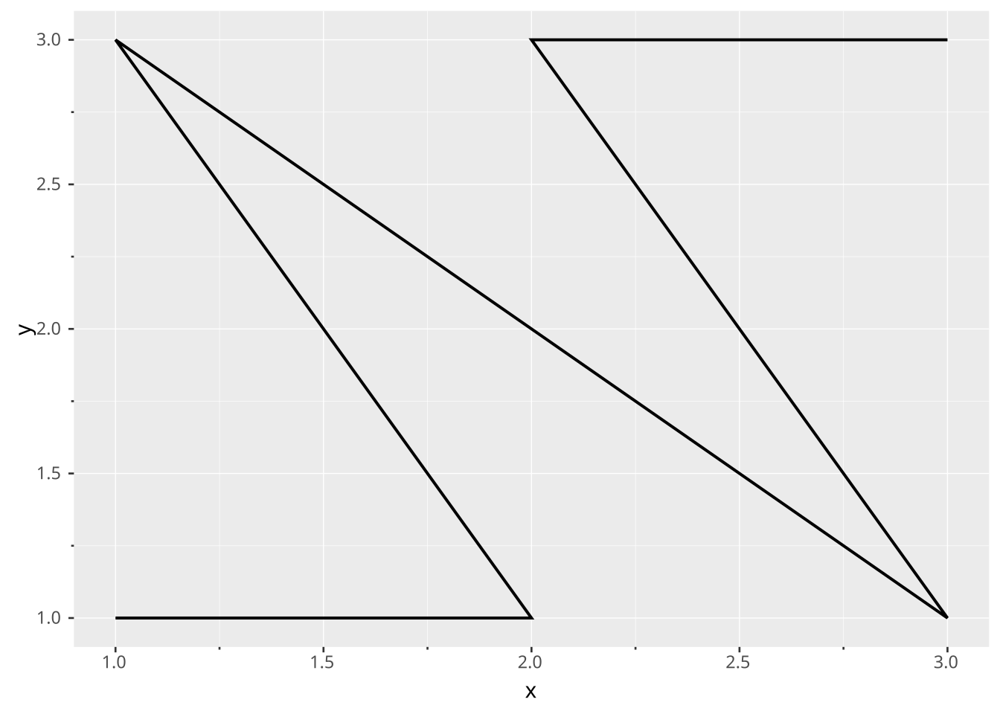
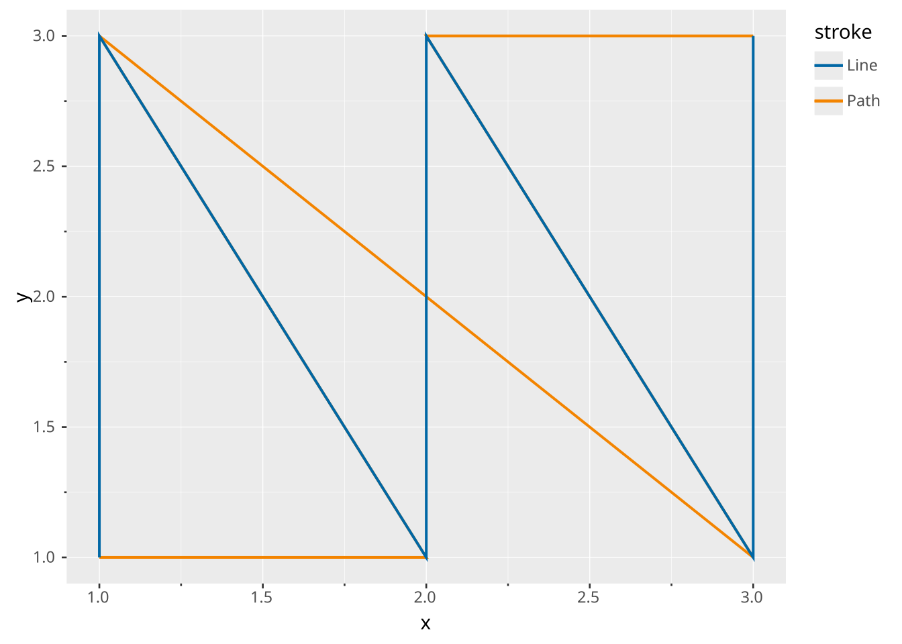
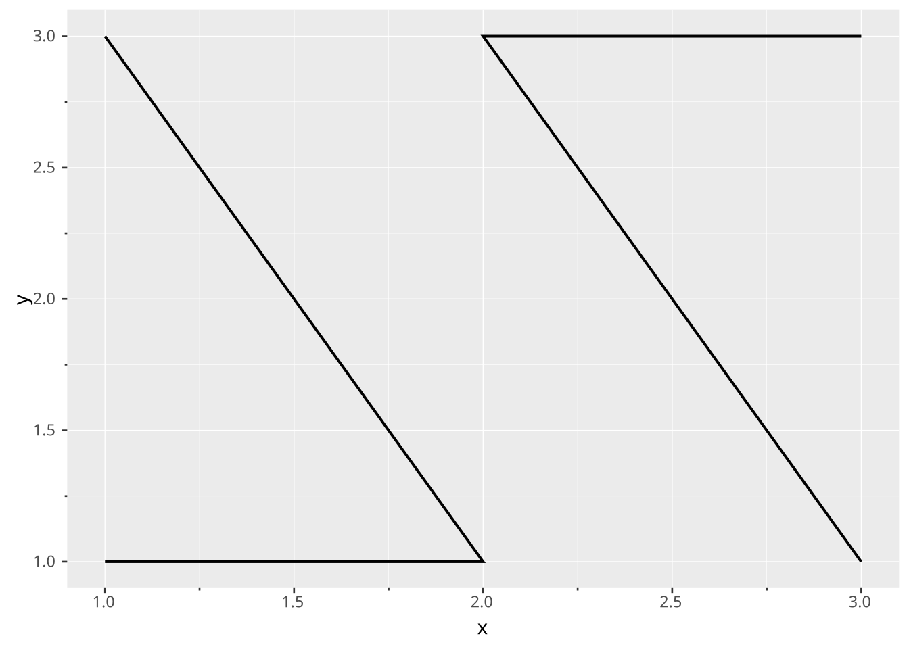
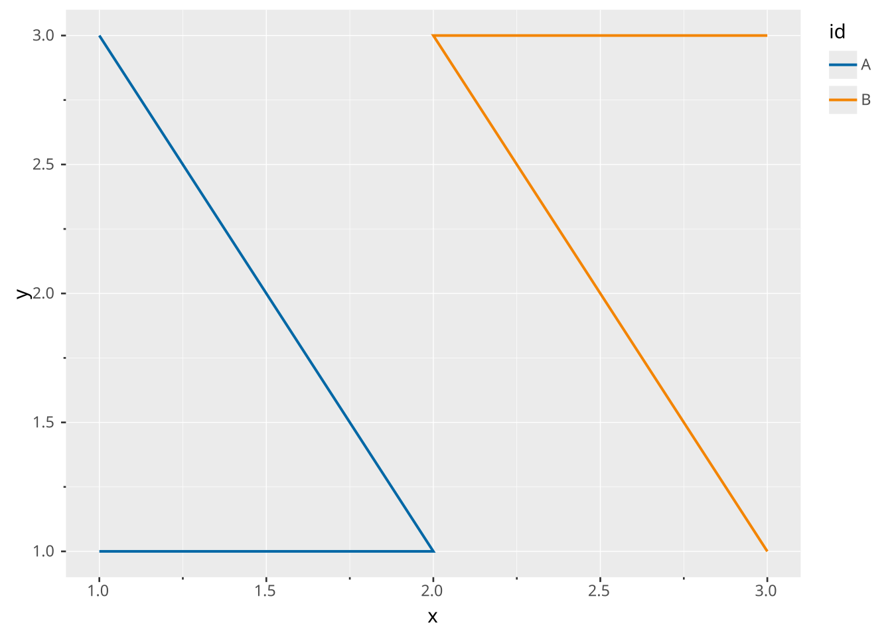
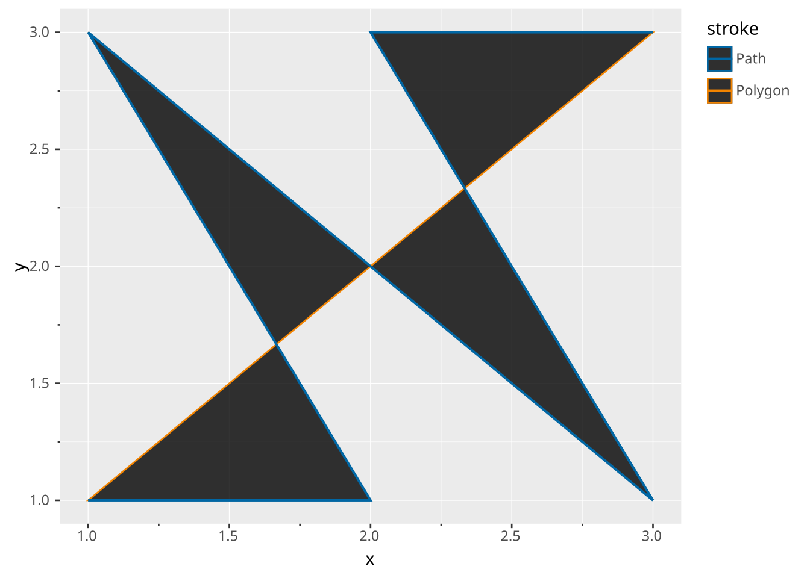
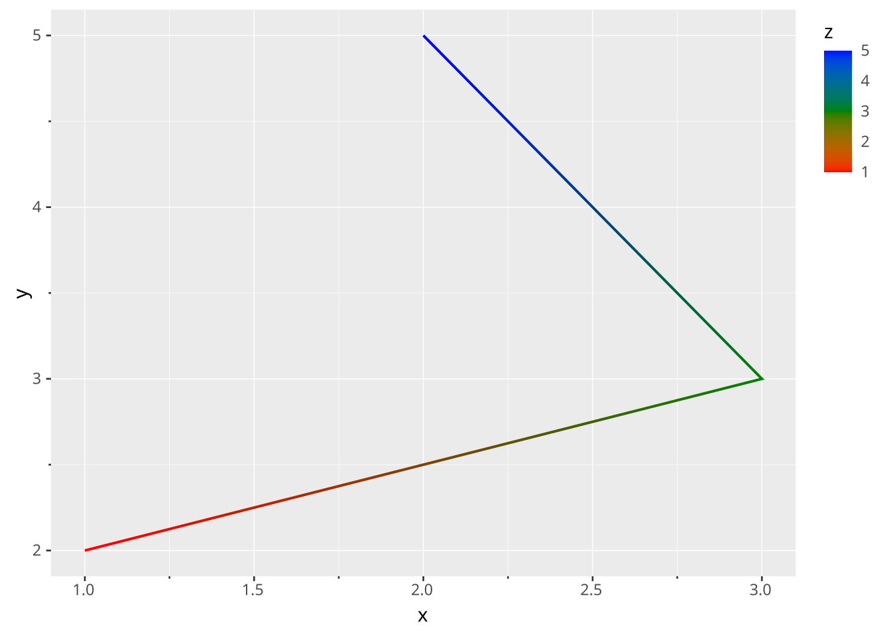
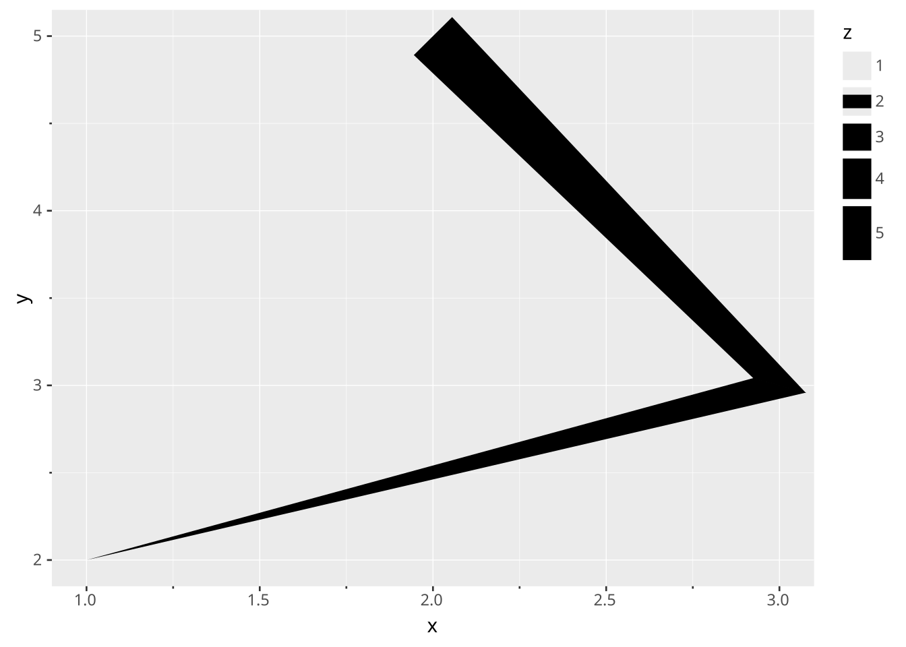

# Path

> Layers are declared with the [`DRAW` clause](../../../syntax/clause/draw.llms.md). Read the documentation for this clause for a thorough description of how to use it.

The path layer is used to create lineplots, but contrary to the [line layer](../../../syntax/layer/type/line.llms.md) the data will not be connected along the x-axis. Instead records are connected in the order they appear in the data. Lines are divided due to their grouping, which is the combination of the discrete mapped aesthetics and the columns specified in the layers [`PARTITION BY`](../../../syntax/clause/draw.llms.md#partition-by).

## Aesthetics

The following aesthetics are recognised by the path layer.

### Required

- Primary axis (e.g. `x`): Position along the primary axis.
- Secondary axis (e.g. `y`): Position along the secondary axis.

### Optional

- `colour`/`stroke`: The colour of the path.
- `opacity`: The opacity of the path.
- `linewidth`: The width of the path. If `linewidth` varies within a group, `linetype` is incompatible.
- `linetype`: The type of path, i.e. the dashing pattern.

## Settings

- `position`: Position adjustment. One of `'identity'` (default), `'stack'`, `'dodge'`, or `'jitter'`

## Data transformation

The path layer does not transform its data but passes it through unchanged. If the path has a variable `stroke` or `opacity` aesthetic within groups, the line is broken into segments. Each segment gets the property of the preceding datapoint, so the last datapoint in a group does not transfer these properties.

## Orientation

The path layer has no orientation. The axes are treated symmetrically.

## Examples

Create example data

``` ggsql
CREATE TABLE df AS
WITH t(x, y, id) AS (VALUES
  (1.0, 1.0, 'A'),
  (2.0, 1.0, 'A'),
  (1.0, 3.0, 'A'),
  (3.0, 1.0, 'B'),
  (2.0, 3.0, 'B'),
  (3.0, 3.0, 'B')
)
SELECT * FROM t
```

Simple example path.

``` ggsql
VISUALISE x, y FROM df
DRAW path
```

[](path_files/figure-html/cell-3-output-1.svg)

Contrary to `line` drawings, `path` is not forced to follow the order along the axis.

``` ggsql
VISUALISE x, y FROM df
DRAW path 
  MAPPING 'Path' AS colour
DRAW line 
  MAPPING 'Line' AS colour
```

[](path_files/figure-html/cell-4-output-1.svg)

Groups of individual paths can be declared via `PARTITION BY`.

``` ggsql
VISUALISE x, y FROM df
DRAW path 
  PARTITION BY id
```

[](path_files/figure-html/cell-5-output-1.svg)

Invoking a group through discrete aesthetics works as well.

``` ggsql
VISUALISE x, y FROM df
DRAW path 
  MAPPING id AS colour
```

[](path_files/figure-html/cell-6-output-1.svg)

Compared to polygons, paths don’t close their shapes and fill their interiors.

``` ggsql
VISUALISE x, y FROM df
DRAW polygon 
  MAPPING 'Polygon' AS stroke
DRAW path 
  MAPPING 'Path' AS stroke
```

[](path_files/figure-html/cell-7-output-1.svg)

When `stroke` or `opacity` varies, the properties of the preceding datapoint carry over. In the case below, we don’t see the blue of the last datapoint.

``` ggsql
WITH data(x, y, z) AS (VALUES
  (1, 2, 1),
  (3, 3, 3),
  (2, 5, 5),
)

VISUALISE x, y FROM data
DRAW path
  MAPPING z AS stroke
SCALE stroke TO ('red', 'green', 'blue')
```

[](path_files/figure-html/cell-8-output-1.svg)

The `linewidth` aesthetic can vary point to point.

``` ggsql
WITH data(x, y, z) AS (VALUES
  (1, 2, 1),
  (3, 3, 3),
  (2, 5, 5),
)

VISUALISE x, y FROM data
DRAW path
  MAPPING z AS linewidth
SCALE linewidth TO (0, 30)
```

[](path_files/figure-html/cell-9-output-1.svg)
