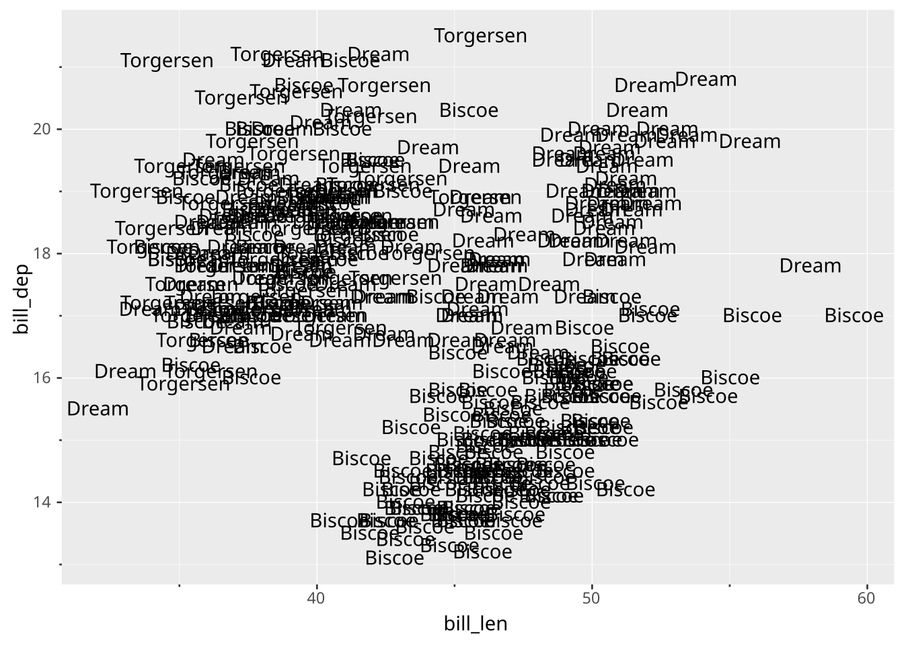
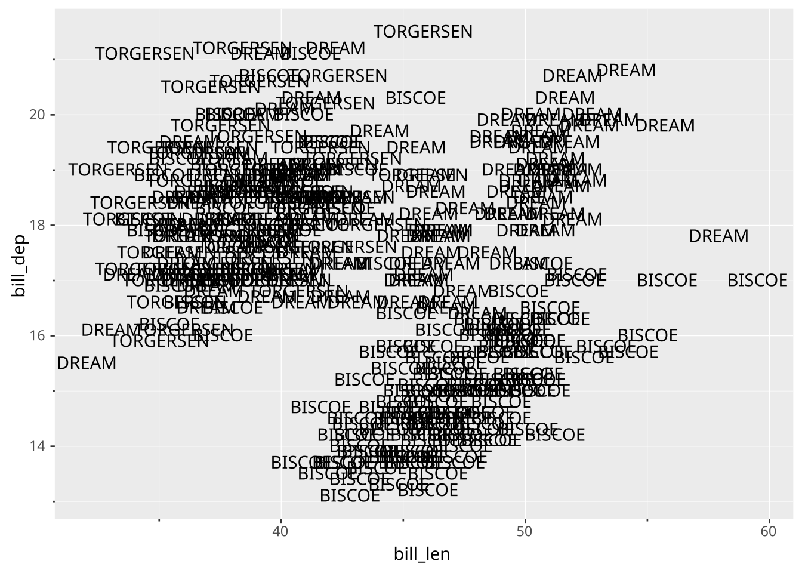
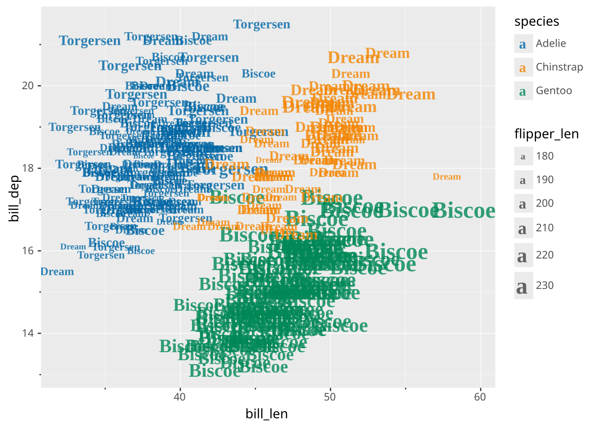
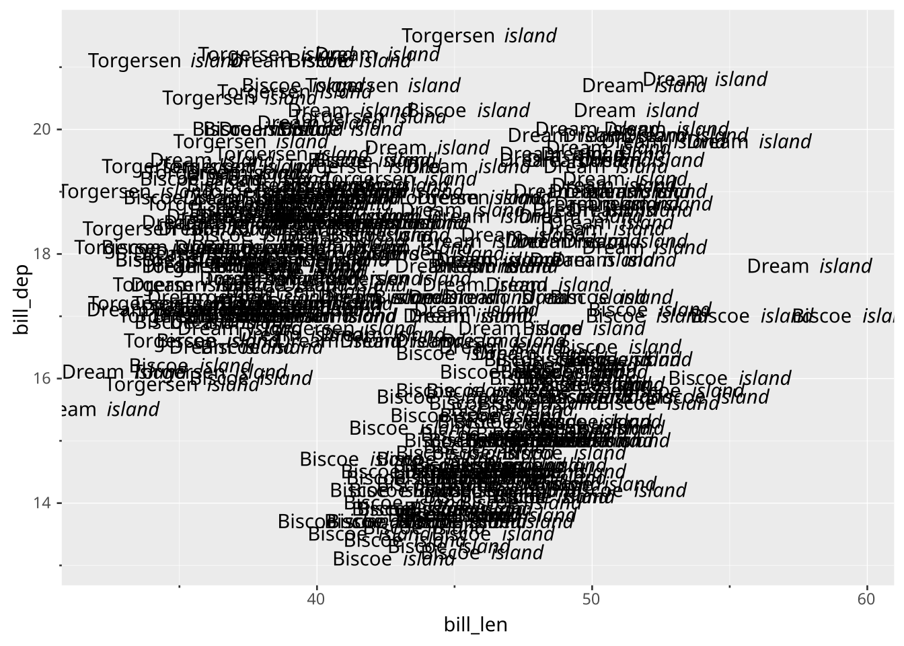
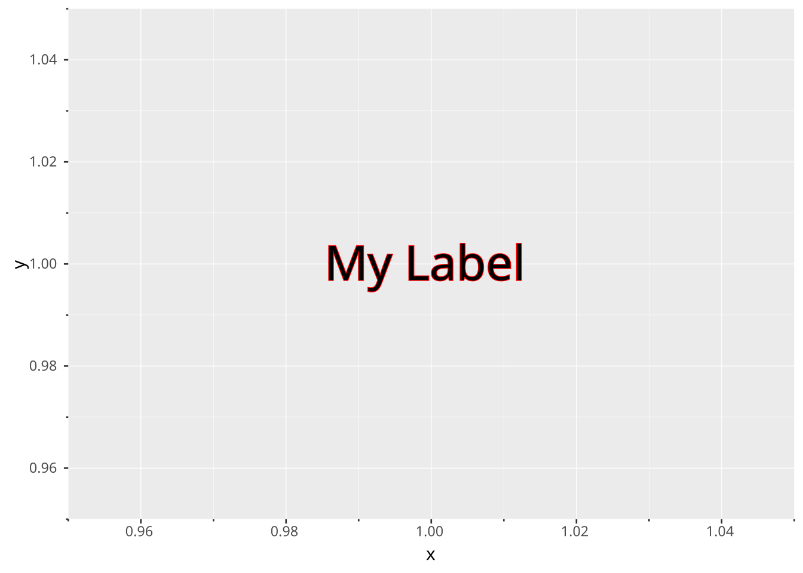
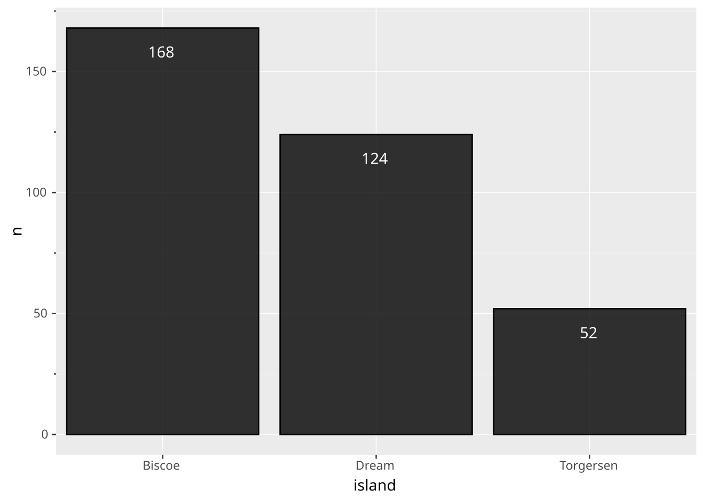
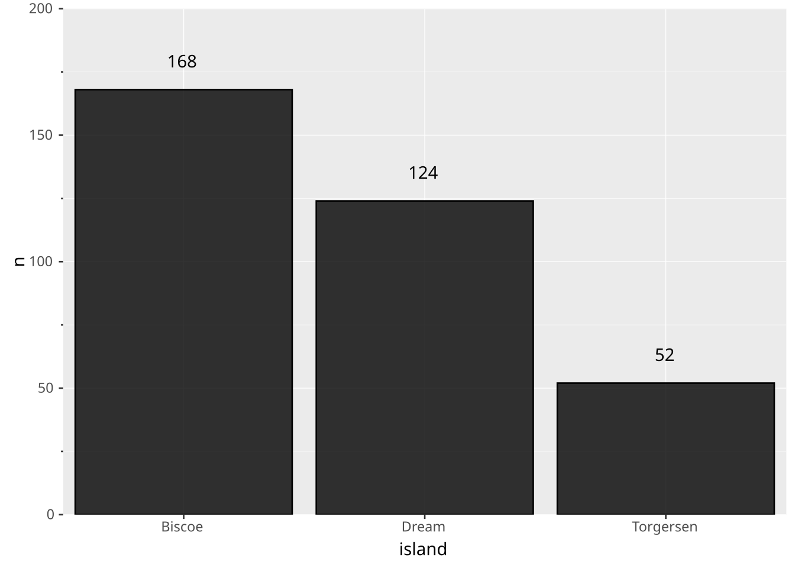
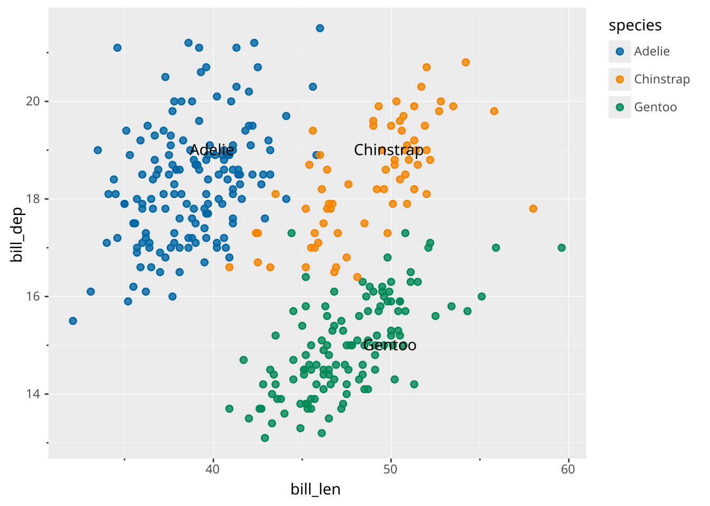
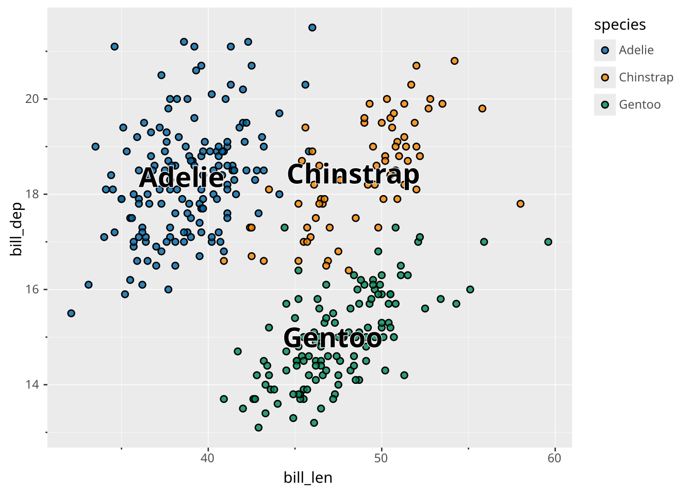

# Text

> Layers are declared with the [`DRAW` clause](../../../syntax/clause/draw.llms.md). Read the documentation for this clause for a thorough description of how to use it.

The text layer displays rows in the data as text. It can be used as a visualisation itself, or used to annotate a different layer.

## Aesthetics

The following aesthetics are recognised by the text layer.

### Required

- Primary axis (e.g. `x`): Position along the primary axis.
- Secondary axis (e.g. `y`): Position along the secondary axis.
- `label` The text to display.

### Optional

- `stroke` The colour of the contour lines of glyphs. Typically kept blank.
- `fill` The colour of the glyphs.
- `colour` Shorthand for setting `stroke` and `fill` simultaneously.
- `opacity` The opacity of the fill colour.
- `typeface` The typeface to style the lettering.
- `fontsize` The size of the text in points.
- `fontweight` Font weight. Interpretation is writer dependent. Vega-Lite converts everything to ‘normal’ or ‘bold’. Can be one of the following:
  - CSS keywords: `'thin'`, `'hairline'`, `'extra-light'`, `'ultra-light'`, `'light'`, `'normal'` (default), `'regular'`, `'lighter'`, `'medium'`, `'semi-bold'`, `'demi-bold'`, `'bold'`, `'bolder'`, `'extra-bold'`, `'ultra-bold'`, `'black'`, `'heavy'`
  - Numeric values between 0-1000.
- `italic` Whether text should be italicised. Boolean value (`true` or `false`).
- `hjust` Horizontal justification. Can be a numeric value between 0-1 or one of `"left"`, `"right"` or `"centre"` (default). Interpretation of numeric values is writer-dependent.
- `vjust` Vertical justification. Can be a numeric value between 0-1 or one of `"top"`, `"bottom"` or `"middle"` (default). Interpretation of numeric values is writer-dependent.
- `rotation` Rotation of the text in degrees.

## Settings

- `offset` Position offset expressed in absolute points. Can be one of the following:
  - a single number that applies both horizontally and vertically
  - a 2-element numeric array `[h, v]` where the first number is the horizontal offset and the second number is the vertical offset.
- `format` Formatting specifier, see explanation below.
- `parse` Whether to read the label as rich text (markdown). Boolean value, `true` by default. See explanation below.
- `position`: Position adjustment. One of `'identity'` (default), `'stack'`, `'dodge'`, or `'jitter'`
- `aggregate` Aggregation functions to apply per group:
  - `null` apply no group aggregation (default).
  - A single string or an array of strings. See an overview of aggregation function in [the `DRAW` documentation](../../../syntax/clause/draw.llms.md#aggregate) and more information in the *Data transformation* section below.

### Format

The `format` setting can take a string that will be used in formatting the `label` aesthetic. The basic syntax for this is that the `label` value will be inserted into any place where `{}` appears. This means that e.g. `SETTING format => '{} species'` will result in the label “adelie species” for a row where the `label` value is “adelie”. Besides simply inserting the value as-is, it is also possible to apply a formatter to `label` before insertion by naming a formatter inside the curly braces prefixed with `:`. Known formatters are:

- `{:Title}` will title-case the value (make the first letter in each work upper case) before insertion, e.g. `SETTING format => '{:Title} species'` will become “Adelie species” for the “adelie” label.
- `{:UPPER}` will make the value upper-case, e.g. `SETTING format => '{:UPPER} species'` will become “ADELIE species” for the “adelie” label.
- `{:lower}` works much like `{:UPPER}` but changes the value to lower-case instead.
- `{:time ...}` will format a date/datetime/time value according to the format defined afterwards. The formatting follows strftime format using the Rust chrono library. You can see an overview of the supported syntax at the [chrono docs](https://docs.rs/chrono/latest/chrono/format/strftime/index.html). The basic usage is `SETTING format => '{:time %B %Y}` which would format a value at 2025-07-04 as “July 2025”.
- `{:num ...}` will format a numeric value according to the format defined afterwards. The format follows the printf format using the Rust sprintf library. The syntax is `%[flags][width][.precision]type` with the following meaning:
  - `flags`: One or more modifiers:
    - `-`: left-justify
    - `+`: Force sign for positive numbers
    - : (space) Space before positive numbers
    - `0`: Zero-pad
    - `#`: Alternate form (`0x` prefix for hex, etc)
  - `width`: The minimum width of characters to render. Depending on the `flags` the string will be padded to be at least this width
  - `precision`: The maximum precision of the number. For `%g`/`%G` it is the total number of digits whereas for the rest it is the number of digits to the right of the decimal point
  - `type`: How to present the number. One of:
    - `d`/`i`: Signed decimal integers
    - `u`: Unsigned decimal integers
    - `f`/`F`: Decimal floating point
    - `e`/`E`: Scientific notation
    - `g`/`G`: Shortest form of `e` and `f`
    - `o`: Unsigned octal
    - `x`/`X`: Unsigned hexadecimal

### Parse

By default the label is read as markdown, so `'**Adelie**'` draws a bold *Adelie* rather than the asterisks around it. Set `parse => false` to draw the label exactly as it is, markers and all.

The markdown flavour recognised is CommonMark plus a few extensions. The most useful parts for a label are:

- `**bold**` and `*italic*`. Note that `_underline_` underlines rather than italicises.
- `~~strikethrough~~`.
- `` `code` ``, rendered in the monospace typeface.
- `{selector body}` spans, which style a fragment without a dedicated marker. The selector is a single token: a colour name or CSS colour (`{.red hot}`), a hex colour (`{#0072B2 blue}`), or a size in points (`{.20 big}`). Combine them by nesting: `{.red {.20 big and red}}`.

Note that `parse` is not honoured by the Vega-Lite writer, which has no rich text and always draws the label literally, so a query meant for both writers should either avoid markdown in its labels or set `parse => false`.

## Data transformation

This layer supports aggregation through the `aggregate` setting. Aggregation groups are defined by `PARTITION BY` and all discrete mappings. Within each group, every numeric mapping is replaced in place by its aggregated value. Use a default like `'mean'` or target individual aesthetics with `'<aes>:<func>'`. See [the `DRAW` documentation](../../../syntax/clause/draw.llms.md#aggregate) for the full setting shape.

## Orientation

The text layer has no orientation. The axes are treated symmetrically.

## Examples

Standard drawing data points as labels.

``` ggsql
VISUALISE bill_len AS x, bill_dep AS y FROM ggsql:penguins
DRAW text 
  MAPPING island AS label
```

[](text_files/figure-html/cell-2-output-1.svg)

You can use the `format` setting to tweak the display of the label.

``` ggsql
VISUALISE bill_len AS x, bill_dep AS y FROM ggsql:penguins
DRAW text 
  MAPPING island AS label
  SETTING format => '{:UPPER}'
```

[](text_files/figure-html/cell-3-output-1.svg)

Setting font properties. Colours are typically mapped to the fill.

``` ggsql
VISUALISE bill_len AS x, bill_dep AS y FROM ggsql:penguins
DRAW text 
  MAPPING island AS label, species AS fill, flipper_len AS fontsize
  SETTING 
    opacity => 0.8, 
    fontweight => 'bold', 
    typeface => 'Times New Roman'
SCALE fontsize TO (6, 20)
```

[](text_files/figure-html/cell-4-output-1.svg)

Labels are read as markdown, so a `format` template can style part of the label. This does not show up in Vega-Lite output, which has no rich text.

``` ggsql
VISUALISE bill_len AS x, bill_dep AS y FROM ggsql:penguins
DRAW text
  MAPPING island AS label
  SETTING format => '{:Title} *island*'
```

[](text_files/figure-html/cell-5-output-1.svg)

The ‘stroke’ aesthetic is applied to the outline of the text.

``` ggsql
SELECT 1 as x, 1 as y
VISUALISE x, y, 'My Label' AS label
DRAW text
  SETTING fontsize => 30, stroke => 'red'
```

[](text_files/figure-html/cell-6-output-1.svg)

Labelling precomputed bars with the data value.

``` ggsql
SELECT island, COUNT(*) AS n FROM ggsql:penguins GROUP BY island
VISUALISE island AS x, n AS y
DRAW bar
DRAW text
  MAPPING n AS label
  SETTING vjust => 'top', offset => (0, -11), fill => 'white'
```

[](text_files/figure-html/cell-7-output-1.svg)

If you label bars at the extreme end, you may need to expand the scale to accommodate the labels.

``` ggsql
SELECT island, COUNT(*) AS n FROM ggsql:penguins GROUP BY island
VISUALISE island AS x, n AS y
DRAW bar
DRAW text
  MAPPING n AS label
  SETTING vjust => 'bottom', offset => (0, 11)
SCALE y FROM (0, 200)
```

[](text_files/figure-html/cell-8-output-1.svg)

You can use `PLACE` to annotate a plot directly without needing to map data.

``` ggsql
VISUALISE bill_len AS x, bill_dep AS y FROM ggsql:penguins
DRAW point MAPPING species AS colour
PLACE text 
  SETTING
    label => ('Adelie', 'Chinstrap', 'Gentoo'),
    x => (40, 50, 50),
    y => (19, 19, 15)
```

[](text_files/figure-html/cell-9-output-1.svg)

Use aggregation to place labels at their centroid.

``` ggsql
VISUALISE bill_len AS x, bill_dep AS y FROM ggsql:penguins
DRAW point
  MAPPING species AS fill
DRAW text
  MAPPING species AS label
  SETTING aggregate => 'mean', stroke => 'white', fontweight => 'bold', fontsize => 20
```

[](text_files/figure-html/cell-10-output-1.svg)
