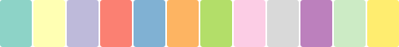
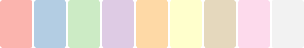
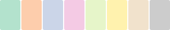

# Fill and stroke

Color values are used in two places in ggsql: When setting stroke color and fill color. Stroke color governs the color of lines, be it the outline of a rectangle (e.g. in a [bar layer](../../../syntax/layer/type/bar.llms.md)), or the line of a path (e.g. in a [line layer](../../../syntax/layer/type/line.llms.md)). The fill color determines the color of the inside of a shape. It follows that all layers respond to the stroke aesthetic but only those containing closed shapes respond to the fill aesthetic.

## The color meta-aesthetic

In addition to the `fill` and `stroke` aesthetics there is also a `color` meta-aesthetic. Setting this will set the fill *and* stroke at the same time unless they are set directly. For instance, the following will set the fill and stroke to red

``` ggsql
DRAW bar
  SETTING color => 'red'
```

whereas this will set the fill to red and stroke to black

``` ggsql
DRAW bar
  SETTING color => 'red', stroke => 'black'
```

The same logic applies when defining a scale. Defining a `color` scale creates two scales, one for `fill` and one for `stroke`, with the same settings (unless either are defined explicitly). For instance, the following

``` ggsql
SCALE color TO viridis
```

defines two separate scales for `fill` and `stroke` that both use the `viridis` palette.

In general, it is highly advisable to be explicit and directly use the `fill` and `stroke` aesthetics. The `color` meta-aesthetic is a quick shortcut if you need it.

## Literal values

Literal color values can be defined in any CSS compatible way [^1]. The gist of it is that colors can be defined in one of three different ways:

- As a named color, e.g. `'red'`, or `'lemonchiffon'`
- As a hex color value, e.g. `'#FF0000'` or `'#FFFACD88'`
- As a css color function, e.g. `'rgba(100%, 0%, 0%, 50%)'` or `'oklab(98%, -0.012, 0.057)'`

Literal color values are used in three places in ggsql. Either when setting an aesthetic (as opposed to mapping), e.g.

``` ggsql
DRAW line
  SETTING stroke => '#FF0000'
```

when you define the output range of a fill or stroke scale manually, e.g.

``` ggsql
SCALE fill TO ('rgb(100%, 0%, 0%)', 'lemonchiffon')
```

or when using an identity scale for color in which case the data values must be parsable as colors.

Note that all different types of color notation can be mixed in the same place.

Literal color values may be translucent, either by providing a fourth channel the the hex-notation, or by using a css color function that includes an alpha level (e.g. `rgba()`). You should avoid mixing this with the use of the opacity aesthetic to ensure the opacity is predictable.

## Palettes

There are two different types of palettes for fill and stroke — those intended for continuous data and those intended for discrete data. While they both consists of multiple color values, the continuous palettes are meant for interpolation between successive values whereas the discrete palettes are not.

Palettes are used by giving them as names in the `TO` clause:

``` ggsql
VISUALISE FROM ggsql:penguins
DRAW point
  MAPPING bill_dep AS x, body_mass AS y, species AS fill
  SETTING stroke => null
SCALE color TO category10
```

Instead of using a named palette you can create one on the fly using an array of color values:

``` ggsql
VISUALISE FROM ggsql:penguins
DRAW point
  MAPPING bill_dep AS x, body_mass AS y, flipper_len AS fill
  SETTING stroke => null
SCALE color TO ('antiquewhite', 'firebrick')
```

### Continuous palettes

#### Sequential

Sequential palettes for numeric data. `sequential` is the default continuous color palette in ggsql.

| Name | Gradient | Source | Description |
|----|----|----|----|
| `sequential` | [](examples/gradient_sequential.svg) | ggsql | **Default.** Blue-teal-green (derived from navia) |
| `acton` | [](examples/gradient_acton.svg) | Crameri | Dark purple-light purple |
| `bamako` | [](examples/gradient_bamako.svg) | Crameri | Teal-olive-cream |
| `batlow` | [](examples/gradient_batlow.svg) | Crameri | Blue-teal-green-brown-pink |
| `batlowk` | [](examples/gradient_batlowk.svg) | Crameri | Dark variant of batlow |
| `batloww` | [](examples/gradient_batloww.svg) | Crameri | Light variant of batlow |
| `bilbao` | [](examples/gradient_bilbao.svg) | Crameri | Brown-tan-white |
| `buda` | [](examples/gradient_buda.svg) | Crameri | Magenta-pink-yellow |
| `davos` | [](examples/gradient_davos.svg) | Crameri | Dark blue-teal-green-white |
| `devon` | [](examples/gradient_devon.svg) | Crameri | Dark purple-blue-white |
| `glasgow` | [](examples/gradient_glasgow.svg) | Crameri | Purple-brown-olive-light purple |
| `grayc` | [](examples/gradient_grayc.svg) | Crameri | Black-white grayscale |
| `hawaii` | [](examples/gradient_hawaii.svg) | Crameri | Magenta-orange-green-cyan |
| `imola` | [](examples/gradient_imola.svg) | Crameri | Blue-teal-green-yellow |
| `lajolla` | [](examples/gradient_lajolla.svg) | Crameri | Dark brown-orange-yellow-cream |
| `lapaz` | [](examples/gradient_lapaz.svg) | Crameri | Dark purple-blue-teal-cream |
| `lipari` | [](examples/gradient_lipari.svg) | Crameri | Dark blue-red-orange-cream |
| `navia` | [](examples/gradient_navia.svg) | Crameri | Blue-teal-green-cream |
| `nuuk` | [](examples/gradient_nuuk.svg) | Crameri | Blue-teal-green-yellow |
| `oslo` | [](examples/gradient_oslo.svg) | Crameri | Black-blue-white |
| `tokyo` | [](examples/gradient_tokyo.svg) | Crameri | Dark purple-magenta-olive-green |
| `turku` | [](examples/gradient_turku.svg) | Crameri | Black-olive-tan-pink |
| `blues` | [](examples/gradient_blues.svg) | ColorBrewer | Light to dark blue |
| `greens` | [](examples/gradient_greens.svg) | ColorBrewer | Light to dark green |
| `oranges` | [](examples/gradient_oranges.svg) | ColorBrewer | Light to dark orange |
| `reds` | [](examples/gradient_reds.svg) | ColorBrewer | Light to dark red |
| `purples` | [](examples/gradient_purples.svg) | ColorBrewer | Light to dark purple |
| `greys` | [](examples/gradient_greys.svg) | ColorBrewer | Light to dark grey (also `grays`) |
| `ylorbr` | [](examples/gradient_ylorbr.svg) | ColorBrewer | Yellow-Orange-Brown |
| `ylorrd` | [](examples/gradient_ylorrd.svg) | ColorBrewer | Yellow-Orange-Red |
| `ylgn` | [](examples/gradient_ylgn.svg) | ColorBrewer | Yellow-Green |
| `ylgnbu` | [](examples/gradient_ylgnbu.svg) | ColorBrewer | Yellow-Green-Blue |
| `gnbu` | [](examples/gradient_gnbu.svg) | ColorBrewer | Green-Blue |
| `bugn` | [](examples/gradient_bugn.svg) | ColorBrewer | Blue-Green |
| `bupu` | [](examples/gradient_bupu.svg) | ColorBrewer | Blue-Purple |
| `pubu` | [](examples/gradient_pubu.svg) | ColorBrewer | Purple-Blue |
| `pubugn` | [](examples/gradient_pubugn.svg) | ColorBrewer | Purple-Blue-Green |
| `purd` | [](examples/gradient_purd.svg) | ColorBrewer | Purple-Red |
| `rdpu` | [](examples/gradient_rdpu.svg) | ColorBrewer | Red-Purple |
| `orrd` | [](examples/gradient_orrd.svg) | ColorBrewer | Orange-Red |
| `viridis` | [](examples/gradient_viridis.svg) | Matplotlib | Dark purple through blue and green to yellow |
| `plasma` | [](examples/gradient_plasma.svg) | Matplotlib | Dark purple through pink to yellow (higher contrast) |
| `magma` | [](examples/gradient_magma.svg) | Matplotlib | Black through purple and pink to light yellow |
| `inferno` | [](examples/gradient_inferno.svg) | Matplotlib | Black through red and orange to light yellow |
| `cividis` | [](examples/gradient_cividis.svg) | Matplotlib | Dark blue through gray to yellow (colorblind-optimized) |

#### Diverging

Diverging palettes emphasize a critical midpoint with two contrasting hues on either side. Ideal for data with a meaningful center point (e.g., zero, average).

| Name | Gradient | Source | Description |
|----|----|----|----|
| `vik` | [](examples/gradient_vik.svg) | Crameri | Blue-white-red (alias: `diverging`) |
| `berlin` | [](examples/gradient_berlin.svg) | Crameri | Light blue-dark-light red |
| `roma` | [](examples/gradient_roma.svg) | Crameri | Brown-cream-blue |
| `bam` | [](examples/gradient_bam.svg) | Crameri | Purple-white-green |
| `broc` | [](examples/gradient_broc.svg) | Crameri | Purple-white-olive |
| `cork` | [](examples/gradient_cork.svg) | Crameri | Purple-white-green |
| `lisbon` | [](examples/gradient_lisbon.svg) | Crameri | Light purple-dark-light yellow |
| `managua` | [](examples/gradient_managua.svg) | Crameri | Yellow-dark-cyan |
| `tofino` | [](examples/gradient_tofino.svg) | Crameri | Light purple-dark-light green |
| `vanimo` | [](examples/gradient_vanimo.svg) | Crameri | Pink-dark-light green |
| `rdbu` | [](examples/gradient_rdbu.svg) | ColorBrewer | Red-Blue |
| `rdylbu` | [](examples/gradient_rdylbu.svg) | ColorBrewer | Red-Yellow-Blue |
| `rdylgn` | [](examples/gradient_rdylgn.svg) | ColorBrewer | Red-Yellow-Green |
| `spectral` | [](examples/gradient_spectral.svg) | ColorBrewer | Spectral (rainbow-like) |
| `brbg` | [](examples/gradient_brbg.svg) | ColorBrewer | Brown-Blue-Green |
| `prgn` | [](examples/gradient_prgn.svg) | ColorBrewer | Purple-Green |
| `piyg` | [](examples/gradient_piyg.svg) | ColorBrewer | Pink-Yellow-Green |
| `rdgy` | [](examples/gradient_rdgy.svg) | ColorBrewer | Red-Grey |
| `puor` | [](examples/gradient_puor.svg) | ColorBrewer | Orange-Purple |

#### Multi-sequential

Multi-sequential palettes have multiple sequential segments, useful for categorical data with ordered subcategories.

| Name | Gradient | Source | Description |
|----|----|----|----|
| `bukavu` | [](examples/gradient_bukavu.svg) | Crameri | Multi-hue sequential |
| `fes` | [](examples/gradient_fes.svg) | Crameri | Multi-hue sequential |
| `oleron` | [](examples/gradient_oleron.svg) | Crameri | Topographic (land/sea) |

#### Cyclic

Cyclic palettes wrap around, making them suitable for periodic data like angles, phases, or time of day.

| Name | Gradient | Source | Description |
|----|----|----|----|
| `romao` | [](examples/gradient_romao.svg) | Crameri | Cyclic purple-orange-teal-blue (alias: `cyclic`) |
| `bamo` | [](examples/gradient_bamo.svg) | Crameri | Cyclic purple-pink-cream-olive |
| `broco` | [](examples/gradient_broco.svg) | Crameri | Cyclic gray-blue-cream-olive |
| `corko` | [](examples/gradient_corko.svg) | Crameri | Cyclic gray-blue-teal-green |
| `viko` | [](examples/gradient_viko.svg) | Crameri | Cyclic purple-blue-cream-orange |

### Discrete palettes

#### Qualitative

Qualitative palettes for categorical data where no ordering is implied.

| Name | Swatches | Colors | Source | Description |
|----|----|----|----|----|
| `ggsql10` | [](examples/swatch_ggsql10.svg) | 10 | ggsql | **Default.** Optimized for distinguishability |
| `tableau10` | [](examples/swatch_tableau10.svg) | 10 | Tableau | Tableau’s default categorical palette |
| `category10` | [](examples/swatch_category10.svg) | 10 | D3 | D3’s default categorical palette |
| `set1` | [](examples/swatch_set1.svg) | 9 | ColorBrewer | Bold, saturated colors |
| `set2` | [](examples/swatch_set2.svg) | 8 | ColorBrewer | Muted, softer colors |
| `set3` | [](examples/swatch_set3.svg) | 12 | ColorBrewer | Pastel-like, lighter colors |
| `pastel1` | [](examples/swatch_pastel1.svg) | 9 | ColorBrewer | Light pastel colors |
| `pastel2` | [](examples/swatch_pastel2.svg) | 8 | ColorBrewer | Soft pastel colors |
| `dark2` | [](examples/swatch_dark2.svg) | 8 | ColorBrewer | Dark, saturated colors |
| `paired` | [](examples/swatch_paired.svg) | 12 | ColorBrewer | Light-dark paired colors |
| `accent` | [](examples/swatch_accent.svg) | 8 | ColorBrewer | Accent colors for emphasis |
| `kelly22` | [](examples/swatch_kelly22.svg) | 20 | Kelly | Maximum contrast colors |

### References

##### Crameri Scientific Colour Maps

Crameri, F. (2018). Scientific colour maps. Zenodo. [doi:10.5281/zenodo.1243862](https://doi.org/10.5281/zenodo.1243862)

Crameri, F., Shephard, G.E., & Heron, P.J. (2020). The misuse of colour in science communication. *Nature Communications*, 11, 5444.

##### ColorBrewer

Brewer, C.A. (2002). ColorBrewer: Color Advice for Cartography. [colorbrewer2.org](https://colorbrewer2.org)

##### Matplotlib

van der Walt, S. & Smith, N. (2015). A Better Default Colormap for Matplotlib. SciPy 2015.

##### Tableau

Tableau Software. [tableau.com](https://www.tableau.com)

##### D3

Bostock, M. D3.js. [d3js.org](https://d3js.org)

##### Kelly’s Colors

Kelly, K.L. (1965). Twenty-two colors of maximum contrast. *Color Engineering*, 3(6), 26-27.

### Choosing a palette

#### For general continuous data

- **`sequential`** (default) - Good all-purpose choice, perceptually uniform
- **`viridis`** - Excellent for print, colorblind-safe, perceptually uniform
- **`batlow`** - Wide perceptual range, good for scientific data

#### For data with a meaningful midpoint

Use a diverging palette:

- **`vik`** or **`berlin`** - Clear red/blue contrast
- **`roma`** - Warm/cool contrast without red/blue

#### For data representing categories with magnitude

Consider multi-sequential palettes:

- **`oleron`** - Good for topographic data

#### For periodic/cyclic data

Use a cyclic palette:

- **`romao`** - Smooth transitions that wrap around

#### For general categorical data

- **`ggsql10`** (default) - Good all-purpose choice, accessible
- **`tableau10`** - Familiar to many users, well-tested
- **`category10`** - Standard web visualization palette

#### For many categories (\> 10)

- **`kelly22`** - Up to 20 distinguishable colors
- **`set3`** or **`paired`** - 12 colors each

#### For subtle/background colors

- **`pastel1`** or **`pastel2`** - Light, unobtrusive
- **`set2`** - Muted but still distinguishable

#### For bold/emphasis

- **`set1`** - Highly saturated, attention-grabbing
- **`dark2`** - Rich, deep colors

#### For paired/related categories

- **`paired`** - Light-dark pairs show relationships

## Accessibility

- *Don’t rely on color alone:* Use redundant encoding by combining color with shape, pattern, or direct labels. This ensures information is accessible when color cannot be perceived.
- *Choose colorblind-safe palettes:* Approximately 8% of men and 0.5% of women have some form of color vision deficiency. Palettes like `viridis`, `cividis`, and the Crameri scientific palettes are designed to be distinguishable by colorblind viewers.
- *Avoid red-green combinations:* Red-green color blindness (deuteranopia/protanopia) is the most common form. Avoid using red and green as the only distinguishing colors between categories.
- *Ensure sufficient contrast:* Light colors on light backgrounds or dark colors on dark backgrounds can be difficult to perceive. Aim for a contrast ratio of at least 3:1 for graphical elements.
- *Test in grayscale:* Print or display your visualization in grayscale to verify that information is still distinguishable without color. Palettes like `viridis` and `cividis` maintain luminance variation when desaturated.
- *Limit the number of colors:* Most people can only reliably distinguish 6-8 colors at a glance. For more categories, consider grouping, faceting, or interactive filtering instead of adding more colors.
- *Use perceptually uniform palettes:* Palettes where equal data differences produce equal perceived color differences prevent visual distortion of your data. The Crameri and matplotlib palettes (`viridis`, `plasma`, etc.) are perceptually uniform.
- *Consider cultural associations:* Colors carry different meanings across cultures (e.g., red can signify danger, luck, or political affiliation). Be mindful of unintended connotations in your audience.
- *Provide alternatives:* When possible, offer a data table or text description alongside color-encoded visualizations for users who cannot perceive the colors.

## Footnotes

[^1]: For a complete overview see the [documentation for the csscolorparser crate](https://docs.rs/csscolorparser/latest/csscolorparser/) which is what we use internally.
