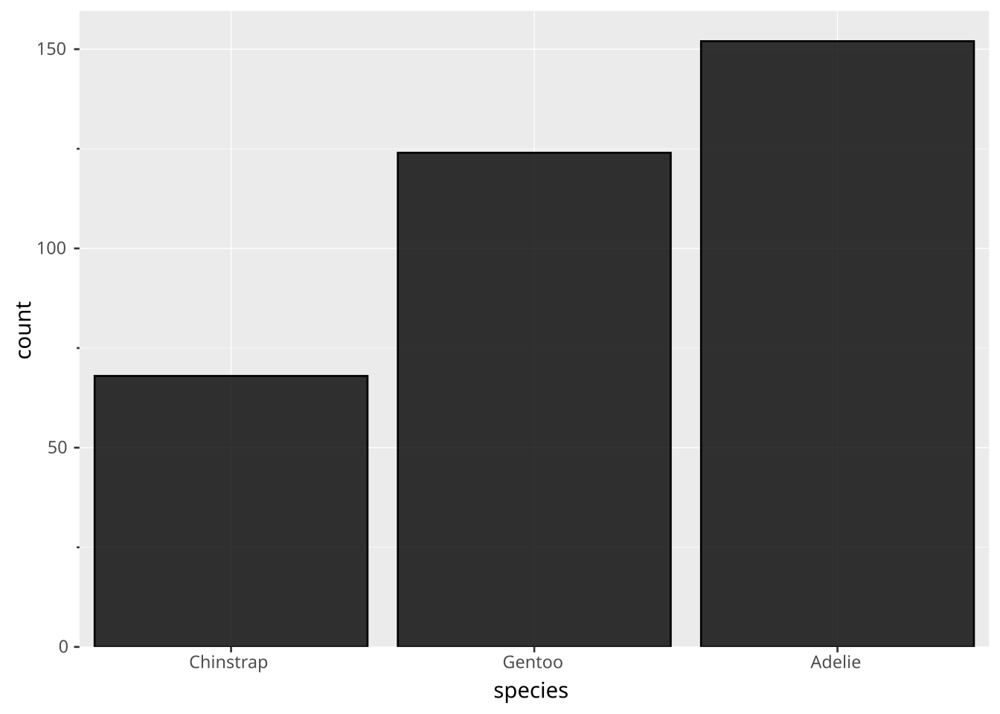
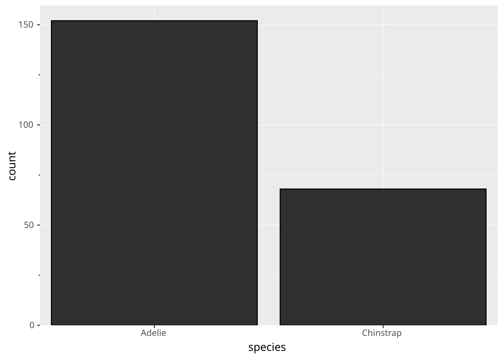
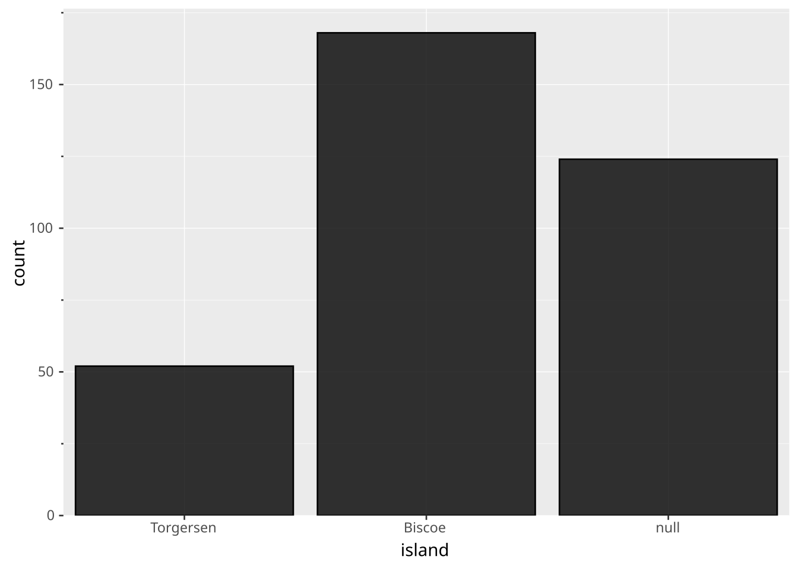
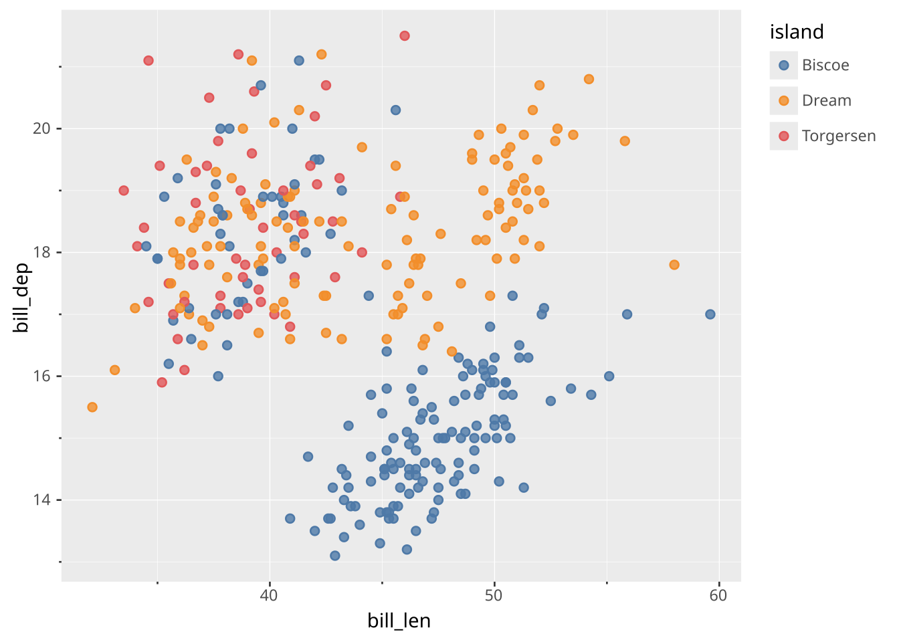
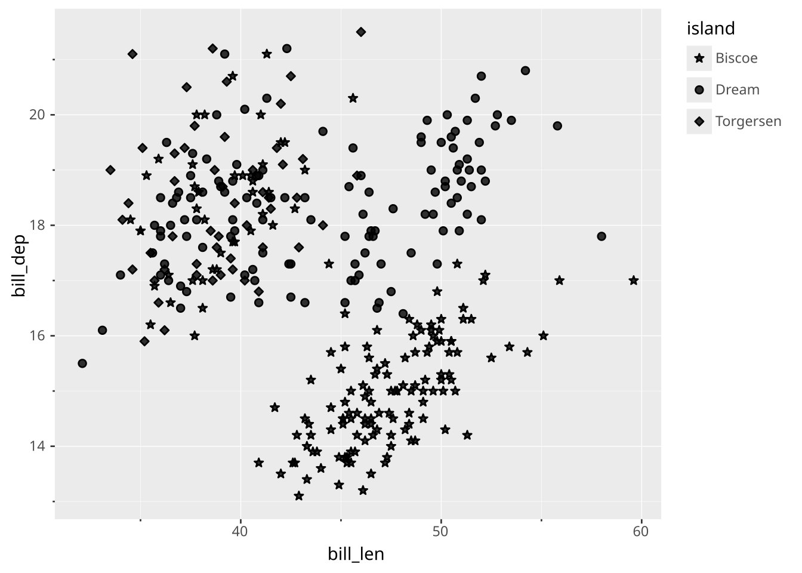
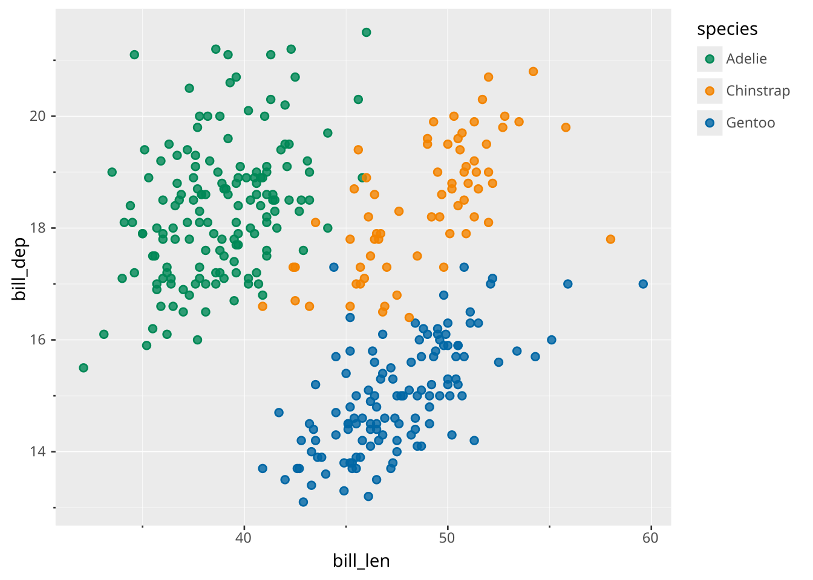
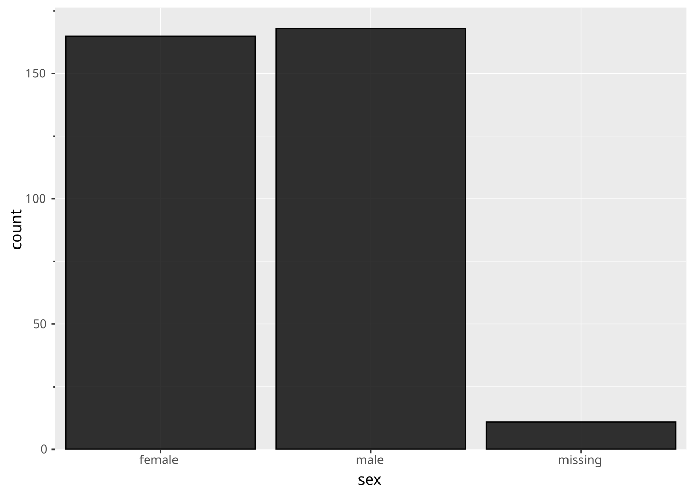
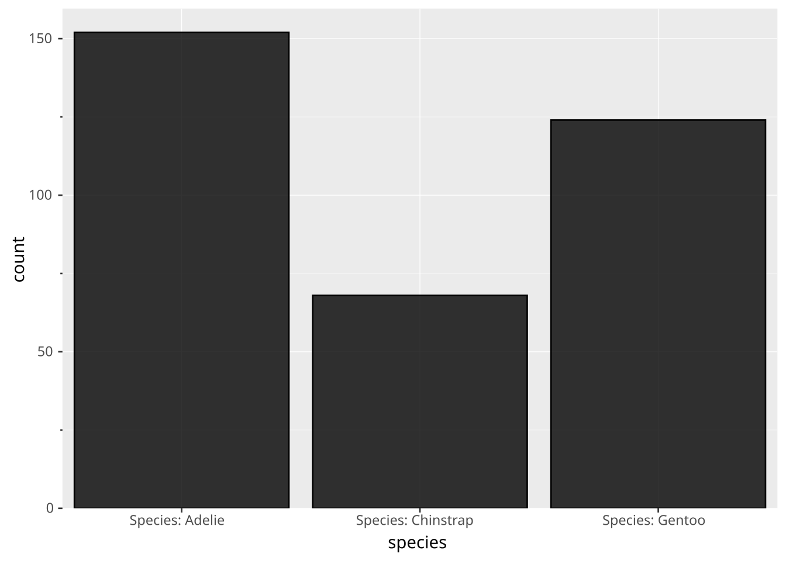
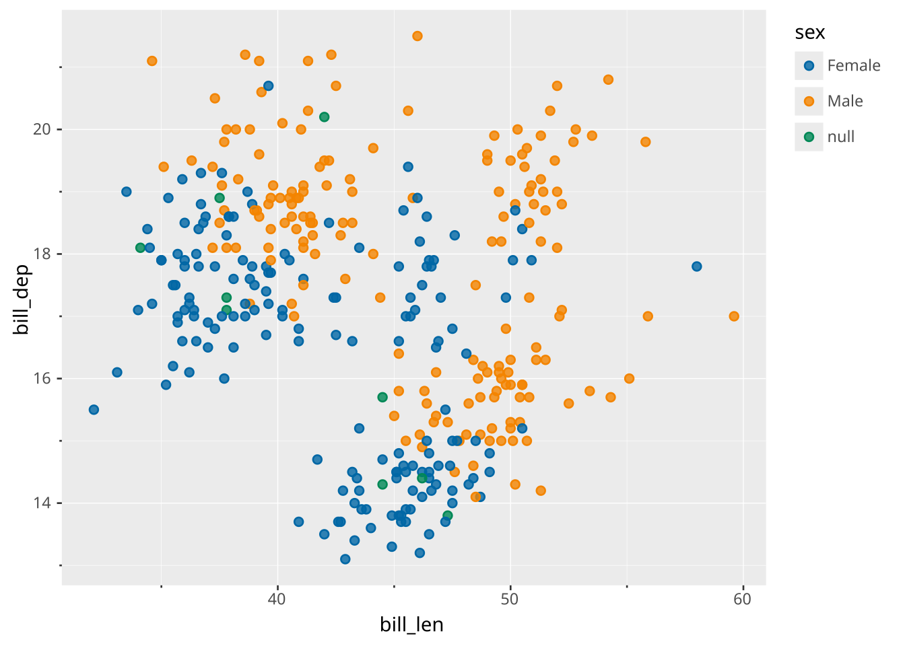

# Discrete

> Scales are declared with the [`SCALE` clause](../../../syntax/clause/scale.llms.md). Read the documentation for this clause for a thorough description of its syntax.

The discrete scale type maps various categorical data types into a discrete output domain. The two categorical data types in ggsql are strings and booleans with strings being the most common. However, you can force a numeric data type into being discrete by explicitly using a discrete scale (e.g. `SCALE DISCRETE x`)

## Input range

The input range for discrete scales consists of all the unique values that the scale understands. Their ordering in the input range will determine their ordering in the display, either in the legend or the axis. Values in the data that do not exist in the input range will be set to `null`.

### Examples

#### Set order of bars using input range

``` ggsql
VISUALISE species AS x FROM ggsql:penguins
DRAW bar
SCALE x FROM ('Chinstrap', 'Gentoo', 'Adelie')
SCALE y FROM (0, null)
```

[](discrete_files/figure-html/cell-2-output-1.svg)

#### Remove a category by omitting it

``` ggsql
VISUALISE species AS x FROM ggsql:penguins
DRAW bar
SCALE x FROM ('Adelie', 'Chinstrap')
SCALE y FROM (0, null)
```

[](discrete_files/figure-html/cell-3-output-1.svg)

#### Explicitly include null in range to show removed data

``` ggsql
VISUALISE island AS x FROM ggsql:penguins
DRAW bar
SCALE x FROM ('Torgersen', 'Biscoe', null)
SCALE y FROM (0, null)
```

[](discrete_files/figure-html/cell-4-output-1.svg)

## Output range

The output range can either be given as an array of values or a named palette. For both of these, the requirement is that they contain at least the number of values as is present in the input range. There are discrete palettes for both [`color`](../../../syntax/scale/aesthetic/1_color.llms.md#discrete-palettes), [`linetype`](../../../syntax/scale/aesthetic/linetype.llms.md#palettes), and [`shape`](../../../syntax/scale/aesthetic/shape.llms.md#palettes).

All aesthetics have a default output range so it is never required to provide one unless you want to change from the default. The defaults are as follows:

- `x`/`y`: Ignored (values used directly)
- `stroke`/`fill`: The `ggsql` palette
- `linetype`: The `default` palette
- `shape`: The `shapes` palette

The remaining aesthetics don’t have a meaningful discrete output domain and don’t work with discrete scales. Consider using an [ordinal scale](../../../syntax/scale/type/ordinal.llms.md) for these if necessary.

### Examples

#### Choose a different color palette

``` ggsql
VISUALISE bill_len AS x, bill_dep AS y, island AS color FROM ggsql:penguins
DRAW point
SCALE color TO tableau
```

[](discrete_files/figure-html/cell-5-output-1.svg)

#### Construct a manual output range

``` ggsql
VISUALISE bill_len AS x, bill_dep AS y, island AS shape FROM ggsql:penguins
DRAW point
SCALE shape TO ('star', 'circle', 'diamond')
```

[](discrete_files/figure-html/cell-6-output-1.svg)

## Transform

There are two transforms relevant to discrete scales and they are only used for casting the data. The `string` transform converts all data mapped to the scale into strings, and the `bool` transform will cast all mapped data into a booleans. Apart from this, they have no effect.

## Settings

There is only one setting relevant for discrete scales:

- `reverse`: Reverses the order of the scale. Defaults to `false`

### Examples

#### Reverse the color legend

``` ggsql
VISUALISE bill_len AS x, bill_dep AS y, species AS color FROM ggsql:penguins
DRAW point
SCALE color FROM ('Adelie', 'Chinstrap', 'Gentoo')
  SETTING reverse => true
```

[](discrete_files/figure-html/cell-7-output-1.svg)

## Renaming

Breaks are generally named by their value. However, you may wish to rename one, several, or all of these. The `RENAMING` clause allows you to do that both by directly renaming a specific break or by providing a formatting function.

### Direct renaming

When you provide a break value on the left and a break exists at that value then it will take on the label specified on the right. For example adding RENAMING ‘Adelie’ =\> ‘Adélie’ will ensure that the species name will get the correct diacrit in the label.

### Label formatting

Besides direct renaming you can also provide a formatting string if you want the same to happen to all labels, e.g. add a prefix or suffix. The syntax for this is `RENAMING * => '... {} ...'`. The current label will be inserted into the `{}` to produce the new label. Besides simply inserting the break value into the string, we can also provide a formatter. Of special interest to discrete scales are the `:Title`, `:lower`, and `:UPPER` formatters which lets you control the casing of strings. You can read more about these formatters in [the break formatting section of the `SCALE` documentation](../../../syntax/clause/scale.llms.md#break-formatting)

You can combine formatting with direct renaming in which case the direct renaming has priority over the formatting.

### Examples

#### Rename null

``` ggsql
VISUALISE sex AS x FROM ggsql:penguins
DRAW bar
SCALE x
  RENAMING 'null' => 'missing'
SCALE y FROM (0, null)
```

[](discrete_files/figure-html/cell-8-output-1.svg)

#### Add prefix

``` ggsql
VISUALISE species AS x FROM ggsql:penguins
DRAW bar
SCALE x
  RENAMING * => 'Species: {}'
SCALE y FROM (0, null)
```

[](discrete_files/figure-html/cell-9-output-1.svg)

#### Apply formatting

``` ggsql
VISUALISE bill_len AS x, bill_dep AS y, sex AS color FROM ggsql:penguins
DRAW point
SCALE color
  RENAMING * => '{:Title}'
```

[](discrete_files/figure-html/cell-10-output-1.svg)
