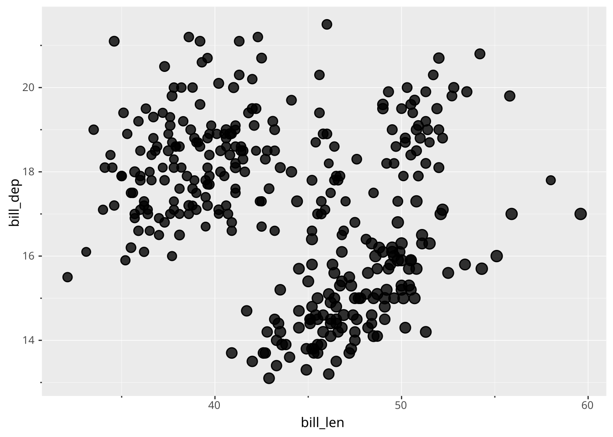
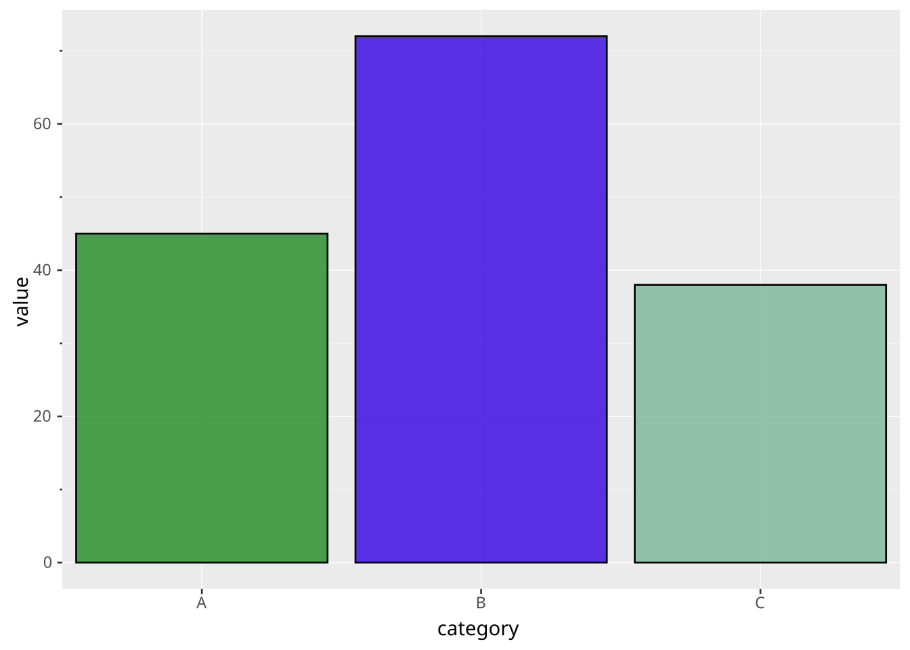

# Identity

> Scales are declared with the [`SCALE` clause](../../../syntax/clause/scale.llms.md). Read the documentation for this clause for a thorough description of its syntax.

The identity scale is a special scale that allows the input to flow through unchanged. You can use this if your data already contains values in a format understood by the aesthetic, e.g. a column of color values mapped to fill. It doesn’t take any additional settings.

Since the values are used as-is, they are read exactly the way a literal given with [`SETTING`](../../../syntax/clause/draw.llms.md) is read, in the same unit and the same vocabulary: a column mapped to [`size`](../../../syntax/scale/aesthetic/size.llms.md) is a radius in points, one mapped to [`linewidth`](../../../syntax/scale/aesthetic/linewidth.llms.md) is a width in points, and one mapped to [`shape`](../../../syntax/scale/aesthetic/shape.llms.md) or [`linetype`](../../../syntax/scale/aesthetic/linetype.llms.md) holds the same names you would write as a setting (`'star'`, `'dashed'`). Data measured in something else needs converting in SQL first.

Since the identity scale doesn’t do any translation of data it doesn’t create a legend.

### Examples

#### Use data values directly for size

`flipper_len` is measured in millimetres, so it is scaled down in SQL to give radii of a few points before being handed to the aesthetic:

``` ggsql
SELECT bill_len, bill_dep, flipper_len / 40.0 AS radius FROM ggsql:penguins
VISUALISE bill_len AS x, bill_dep AS y, radius AS size
DRAW point
SCALE IDENTITY size
```

[](identity_files/figure-html/cell-2-output-1.svg)

#### Use color values directly

``` ggsql
WITH t(category, value, style) AS (VALUES
  ('A', 45, 'forestgreen'),
  ('B', 72, '#3401e3'),
  ('C', 38, 'hsl(150deg 30% 60%)')
)
SELECT * FROM t

VISUALISE category AS x, value AS y, style AS fill
DRAW bar
SCALE IDENTITY fill
```

[](identity_files/figure-html/cell-3-output-1.svg)
